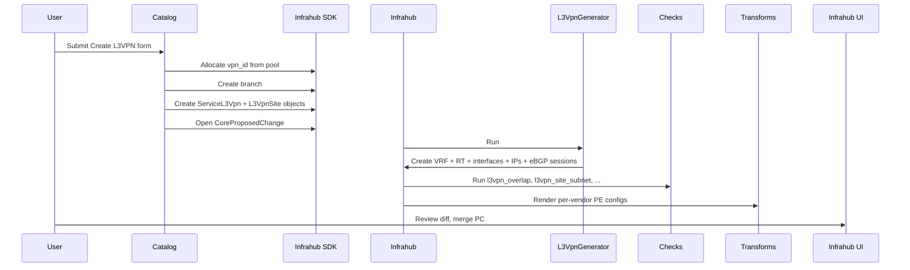

# SP Demo MPLS L3VPN Implementation Plan

> **For agentic workers:** REQUIRED SUB-SKILL: Use superpowers:subagent-driven-development (recommended) or superpowers:executing-plans to implement this plan task-by-task. Steps use checkbox (`- [ ]`) syntax for tracking.

**Goal:** Build an Infrahub demo repository (`sp-demo-mpls-l3vpn`) that models a multi-vendor MPLS backbone (Arista EOS, Cisco IOS-XR, Juniper Junos, Nokia SR OS) and provisions L3VPNs as a service through a Streamlit Service Catalog, with an optional containerlab artifact for Arista cEOS + Nokia SR Linux.

**Architecture:** Mirrors `infrahub-demo-dc` patterns: schema in `schemas/{base,extensions,sp}/`, bootstrap data in `objects/`, per-vendor Python+Jinja2 config transforms, one L3VPN generator, four checks, two Streamlit catalog pages (Dashboard + Create L3VPN), `invoke` tasks for orchestration. Backbone is static demo data; L3VPN service is dynamic and runs through the proposed-change pipeline.

**Tech Stack:** Python 3.12, `uv`, ruff, mypy, pytest; Infrahub SDK (`infrahub-sdk>=1.15.1,<2.0.0`); Jinja2; Streamlit; containerlab (Arista cEOS + Nokia SR Linux).

**Design spec:** `docs/superpowers/specs/2026-05-15-sp-demo-mpls-l3vpn-design.md` — refer to it for vendor canon, schema field tables, and out-of-scope items.

**Implementation notes (apply throughout):**

- When writing schema YAML, invoke the `infrahub:infrahub-managing-schemas` skill — it runs the validate-against-Infrahub loop.
- When writing bootstrap data, invoke `infrahub:infrahub-managing-objects`.
- When writing the generator, invoke `infrahub:infrahub-managing-generators`.
- When writing transforms, invoke `infrahub:infrahub-managing-transforms`.
- When writing checks, invoke `infrahub:infrahub-managing-checks`.
- When writing the menu, invoke `infrahub:infrahub-managing-menus`.
- After all phases complete, run `infrahub:infrahub-auditing-repo` for compliance.
- All Python: type hints on every signature, Google-style docstrings on modules/classes/functions, max line length 100, `pathlib` over `os.path`, no bare `except`.
- After every code change in a task: run `uv run invoke lint` before committing.
- Coverage target: ≥ 70%.
- Never auto-commit; this plan instructs an engineer (or subagent) to commit. Commit messages should not include "Co-Authored-By" or "Generated with Claude" lines (per the user's global CLAUDE.md).

---

## Phase Overview

| Phase | Topic | Deliverable |
|---|---|---|
| 0 | Repo scaffolding | `uv sync` + `invoke start` brings up empty Infrahub |
| 1 | Schemas | `invoke bootstrap` loads schemas; UI shows SP nodes |
| 2 | Bootstrap data | Backbone, PEs, pools, tenants loaded |
| 3 | L3VPN generator | SDK-created L3VPN materialises VRF + interfaces + IPs |
| 4 | Per-vendor PE transforms | Config artifact renders for each of 4 PEs |
| 5 | Containerlab transform | clab-mpls-topology artifact renders |
| 6 | Checks | Four checks gate the proposed-change pipeline |
| 7 | Streamlit catalog | Create L3VPN end-to-end via UI |
| 8 | Lab integration | `invoke lab.deploy` brings up cEOS + SR Linux + CEs |
| 9 | Docs | Quickstart, architecture, schema reference, service docs |
| 10 | Audit + polish | `invoke init` works clean; repo audit passes |

---

## Phase 0: Repo scaffolding

### Task 0.1: `pyproject.toml`

**Files:**
- Create: `pyproject.toml`

- [ ] **Step 1: Write `pyproject.toml`**

```toml
[project]
name = "sp-demo-mpls-l3vpn"
version = "0.1.0"
description = "Infrahub demo: multi-vendor MPLS backbone with L3VPN as a service"
readme = "README.md"
requires-python = ">=3.10,<3.13"
license = {text = "MIT"}
authors = [{name = "OpsMill"}]

dependencies = [
    "infrahub-sdk[all]>=1.15.1,<2.0.0",
    "jinja2>=3.1.3",
    "pyyaml>=6.0",
    "rich>=13.7.0",
]

[project.optional-dependencies]
dev = [
    "pytest>=8.0.0",
    "pytest-asyncio>=0.23.0",
    "pytest-cov>=4.1.0",
    "ruff>=0.5.0",
    "mypy>=1.10.0",
    "invoke>=2.2.0",
    "yamllint>=1.35.0",
    "types-PyYAML>=6.0.0",
]

[build-system]
requires = ["hatchling"]
build-backend = "hatchling.build"

[tool.hatch.build.targets.wheel]
packages = ["generators", "transforms", "checks"]

[tool.ruff]
line-length = 100
target-version = "py310"

[tool.ruff.lint]
select = ["E", "F", "W", "I", "B", "UP", "ANN", "D"]
ignore = ["D203", "D213"]

[tool.ruff.lint.pydocstyle]
convention = "google"

[tool.ruff.lint.per-file-ignores]
"tests/*" = ["D", "ANN"]
"scripts/*" = ["D"]

[tool.mypy]
python_version = "3.10"
strict = true
warn_unused_ignores = true

[tool.pytest.ini_options]
testpaths = ["tests"]
asyncio_mode = "auto"
addopts = "-vv --strict-markers"

[tool.coverage.run]
source = ["generators", "transforms", "checks", "service_catalog/utils"]
omit = ["tests/*", "scripts/*"]

[tool.coverage.report]
fail_under = 70
```

- [ ] **Step 2: Run `uv sync` to verify deps resolve**

Run: `uv sync`
Expected: lockfile created, virtualenv populated.

- [ ] **Step 3: Commit**

```bash
git add pyproject.toml uv.lock
git commit -m "Add pyproject.toml with infrahub-sdk and dev tooling"
```

---

### Task 0.2: Configs (`.gitignore`, `.env.example`, `.yamllint.yml`, `.vale.ini`)

**Files:**
- Create: `.gitignore`, `.env.example`, `.yamllint.yml`, `.vale.ini`

- [ ] **Step 1: Write `.gitignore`**

```gitignore
# Python
__pycache__/
*.py[cod]
*$py.class
*.egg-info/
.pytest_cache/
.mypy_cache/
.ruff_cache/
.coverage
htmlcov/
.venv/

# Env
.env
.envrc

# Lab runtime
lab/*
!lab/.gitkeep
clab-*/
*.clab.yml.bak

# IDE
.idea/
.vscode/
*.swp
.DS_Store
```

- [ ] **Step 2: Write `.env.example`**

```bash
# Infrahub server URL (used by SDK and Streamlit catalog)
INFRAHUB_ADDRESS="http://localhost:8000"

# API token (demo only — rotate before any non-local use)
INFRAHUB_API_TOKEN="06438eb2-8019-4776-878c-0941b1f1d1ec"

# Streamlit-side UI URL for links back to Infrahub
INFRAHUB_UI_URL="http://localhost:8000"

# Use local repo for generator/transform code (no GitHub clone needed)
INFRAHUB_GIT_LOCAL="true"

# Port overrides (set when running parallel instances)
# INFRAHUB_PORT=8000
# PREFECT_PORT=4200
# STREAMLIT_PORT=8501
```

- [ ] **Step 3: Write `.yamllint.yml`**

```yaml
---
extends: default

rules:
  line-length:
    max: 120
    level: warning
  document-start: disable
  truthy:
    check-keys: false
  comments:
    min-spaces-from-content: 1
```

- [ ] **Step 4: Write `.vale.ini`**

```ini
StylesPath = .vale
MinAlertLevel = suggestion

[*.md]
BasedOnStyles = Vale
```

- [ ] **Step 5: Commit**

```bash
git add .gitignore .env.example .yamllint.yml .vale.ini
git commit -m "Add gitignore, env example, yamllint, vale config"
```

---

### Task 0.3: `docker-compose.override.yml`

**Files:**
- Create: `docker-compose.override.yml`

- [ ] **Step 1: Write `docker-compose.override.yml`**

```yaml
---
services:
  database:
    environment:
      - NEO4J_dbms_memory_transaction_total_max=8g
      - NEO4J_dbms_memory_heap_initial__size=2g
      - NEO4J_dbms_memory_heap_max__size=4g
      - NEO4J_dbms_memory_pagecache_size=2g

  infrahub-server:
    ports:
      - "${INFRAHUB_PORT:-8000}:8000"

  task-manager:
    ports:
      - "${PREFECT_PORT:-4200}:4200"

  task-worker:
    volumes:
      - ./:/upstream

  streamlit-service-catalog:
    build:
      context: ./service_catalog
      dockerfile: Dockerfile
    container_name: service-catalog
    ports:
      - "${STREAMLIT_PORT:-8501}:8501"
    environment:
      - INFRAHUB_ADDRESS=http://infrahub-server:8000
      - INFRAHUB_UI_URL=${INFRAHUB_UI_URL:-http://localhost:8000}
      - INFRAHUB_API_TOKEN=${INFRAHUB_API_TOKEN:-06438eb2-8019-4776-878c-0941b1f1d1ec}
      - DEFAULT_BRANCH=main
      - GENERATOR_WAIT_TIME=60
    volumes:
      - ./service_catalog:/app
      - ./objects:/objects:ro
    depends_on:
      - infrahub-server
    profiles:
      - service-catalog
    networks:
      - default
```

- [ ] **Step 2: Commit**

```bash
git add docker-compose.override.yml
git commit -m "Add docker-compose override with streamlit catalog profile"
```

---

### Task 0.4: `tasks.py` skeleton

**Files:**
- Create: `tasks.py`

- [ ] **Step 1: Write `tasks.py` with `start`, `destroy`, `bootstrap`, `init`, `lint`, `test` tasks**

```python
"""Invoke tasks for the SP demo MPLS L3VPN repo."""

from __future__ import annotations

import shlex
from pathlib import Path

from invoke.collection import Collection
from invoke.context import Context
from invoke.tasks import task

REPO_ROOT = Path(__file__).resolve().parent
COMPOSE_PROJECT = "sp-demo"


def _compose(c: Context, args: str, profile: str | None = None) -> None:
    """Run docker compose with the demo project name and optional profile."""
    profile_arg = f"--profile {profile}" if profile else ""
    c.run(f"docker compose -p {COMPOSE_PROJECT} {profile_arg} {args}", pty=True)


@task
def start(c: Context, build: bool = False, catalog: bool = False) -> None:
    """Start Infrahub containers. Use --catalog to enable the Streamlit sidecar."""
    build_arg = "--build" if build else ""
    profile = "service-catalog" if catalog else None
    _compose(c, f"up -d {build_arg}", profile=profile)


@task
def destroy(c: Context) -> None:
    """Tear down Infrahub containers and volumes."""
    _compose(c, "down -v", profile="service-catalog")


@task
def bootstrap(c: Context) -> None:
    """Load schemas, menus, and bootstrap object data into Infrahub."""
    c.run("uv run infrahubctl schema load schemas/", pty=True)
    c.run("uv run infrahubctl menu load menus/menu.yml", pty=True)
    for path in sorted(Path("objects").glob("*.yml")):
        c.run(f"uv run infrahubctl object load {shlex.quote(str(path))}", pty=True)
    c.run(
        "uv run infrahubctl protocols --branch main "
        "--output generators/schema_protocols.py",
        pty=True,
    )


@task(name="init")
def init_demo(c: Context) -> None:
    """Destroy, start, and bootstrap the demo end-to-end."""
    destroy(c)
    start(c, build=True)
    c.run("sleep 30", pty=True)
    bootstrap(c)


@task
def lint(c: Context) -> None:
    """Run the full lint suite: ruff, mypy, yamllint."""
    c.run("uv run ruff check .", pty=True)
    c.run("uv run ruff format --check .", pty=True)
    c.run("uv run mypy .", pty=True)
    c.run("uv run yamllint .", pty=True)


@task
def test(c: Context, kind: str = "unit") -> None:
    """Run pytest; kind in {unit, integration, catalog, all}."""
    if kind == "all":
        c.run("uv run pytest tests/", pty=True)
    else:
        c.run(f"uv run pytest tests/{kind}/", pty=True)


# Lab namespace (filled in Phase 8)
lab = Collection("lab")

ns = Collection()
ns.add_task(start)
ns.add_task(destroy)
ns.add_task(bootstrap)
ns.add_task(init_demo)
ns.add_task(lint)
ns.add_task(test)
ns.add_collection(lab)
```

- [ ] **Step 2: Verify `invoke --list` shows tasks**

Run: `uv run invoke --list`
Expected: lists `start`, `destroy`, `bootstrap`, `init`, `lint`, `test`, and `lab` namespace.

- [ ] **Step 3: Commit**

```bash
git add tasks.py
git commit -m "Add invoke task skeleton (start, destroy, bootstrap, init, lint, test)"
```

---

### Task 0.5: `.infrahub.yml` stub

**Files:**
- Create: `.infrahub.yml`

- [ ] **Step 1: Write a minimal `.infrahub.yml`**

```yaml
---
# Schemas, queries, transforms, generators, checks, and artifacts
# are registered here. This file grows as phases progress.

schemas:
  - schemas/base/
  - schemas/extensions/
  - schemas/sp/

menus:
  - menus/menu.yml

queries: []
python_transforms: []
jinja2_transforms: []
artifact_definitions: []
generator_definitions: []
check_definitions: []
```

- [ ] **Step 2: Commit**

```bash
git add .infrahub.yml
git commit -m "Add .infrahub.yml stub with schema registration"
```

---

### Task 0.6: `README.md`, `AGENTS.md`, `LICENSE.txt`

**Files:**
- Create: `README.md`, `AGENTS.md`, `LICENSE.txt`
- Symlink: `CLAUDE.md` → `AGENTS.md`

- [ ] **Step 1: Write `LICENSE.txt`** (copy MIT text from `/Users/pete/src/infrahub-demo-dc/LICENSE.txt`, update copyright year + holder)

- [ ] **Step 2: Write `README.md` skeleton** (full content in Phase 9)

```markdown
# Infrahub SP Demo — MPLS L3VPN

[Infrahub](https://github.com/opsmill/infrahub) demo: multi-vendor MPLS backbone
(Arista EOS, Cisco IOS-XR, Juniper Junos, Nokia SR OS) with L3VPN provisioning
via a Streamlit Service Catalog and an optional containerlab artifact.

## Quick start

```bash
uv sync
uv run invoke init
```

Full documentation is in [`docs/quickstart.md`](docs/quickstart.md).

## License

MIT — see [LICENSE.txt](LICENSE.txt).
```

- [ ] **Step 3: Write `AGENTS.md`** (copy structure from `/Users/pete/src/infrahub-demo-dc/AGENTS.md`, retitle, point to this repo's specifics)

- [ ] **Step 4: Symlink `CLAUDE.md`**

Run: `ln -s AGENTS.md CLAUDE.md`

- [ ] **Step 5: Commit**

```bash
git add README.md AGENTS.md CLAUDE.md LICENSE.txt
git commit -m "Add README, AGENTS, LICENSE scaffolding"
```

---

### Task 0.7: Verify `invoke start` brings up Infrahub

- [ ] **Step 1: Start the stack**

Run: `uv run invoke start --build`
Expected: `infrahub-server`, `database`, `task-manager`, `task-worker`, `message-queue`, `cache` containers running.

- [ ] **Step 2: Confirm Infrahub UI reachable**

Run: `curl -s -o /dev/null -w "%{http_code}\n" http://localhost:8000`
Expected: `200`.

- [ ] **Step 3: Tear down**

Run: `uv run invoke destroy`

- [ ] **Step 4: No commit needed (verification only)**

---

## Phase 1: Schemas

> **Invoke `infrahub:infrahub-managing-schemas` skill at the start of this phase** — it runs the validate-against-Infrahub loop for every schema file.

### Task 1.1: Copy `schemas/base/` from schema-library

**Files:**
- Create: `schemas/base/dcim.yml`, `schemas/base/ipam.yml`, `schemas/base/location.yml`, `schemas/base/organization.yml`

- [ ] **Step 1: Copy base schemas verbatim**

```bash
mkdir -p schemas/base
cp /Users/pete/src/schema-library/base/dcim.yml schemas/base/
cp /Users/pete/src/schema-library/base/ipam.yml schemas/base/
cp /Users/pete/src/schema-library/base/location.yml schemas/base/
cp /Users/pete/src/schema-library/base/organization.yml schemas/base/
```

- [ ] **Step 2: Verify YAML lints clean**

Run: `uv run yamllint schemas/base/`
Expected: no errors.

- [ ] **Step 3: Commit**

```bash
git add schemas/base/
git commit -m "Copy base schemas (dcim, ipam, location, organization) from schema-library"
```

---

### Task 1.2: Copy `schemas/extensions/` from schema-library

**Files:**
- Create: `schemas/extensions/vrf/vrf.yml`, `schemas/extensions/routing/routing.yml`, `schemas/extensions/routing_bgp/bgp.yml`, `schemas/extensions/topology/topology.yml`

- [ ] **Step 1: Copy needed extension dirs**

```bash
mkdir -p schemas/extensions
cp -r /Users/pete/src/schema-library/extensions/vrf schemas/extensions/
cp -r /Users/pete/src/schema-library/extensions/routing schemas/extensions/
cp -r /Users/pete/src/schema-library/extensions/routing_bgp schemas/extensions/
cp -r /Users/pete/src/schema-library/extensions/topology schemas/extensions/
```

- [ ] **Step 2: Verify YAML lints clean**

Run: `uv run yamllint schemas/extensions/`
Expected: no errors.

- [ ] **Step 3: Commit**

```bash
git add schemas/extensions/
git commit -m "Copy extensions (vrf, routing, routing_bgp, topology) from schema-library"
```

---

### Task 1.3: Write `schemas/sp/dcim_role_pe.yml`

**Files:**
- Create: `schemas/sp/dcim_role_pe.yml`

- [ ] **Step 1: Write the schema extension to add PE/P/RR roles**

```yaml
---
# yaml-language-server: $schema=https://schema.infrahub.app/infrahub/schema/latest.json
version: "1.0"

extensions:
  nodes:
    - kind: DcimDevice
      attributes:
        - name: role
          kind: Dropdown
          optional: true
          order_weight: 1400
          choices:
            - name: pe
              label: Provider Edge
              description: PE router terminating customer VPNs.
              color: "#bf7fbf"
            - name: p
              label: Provider Core
              description: P router (transit only, no customer VRFs).
              color: "#7f7fff"
            - name: rr
              label: Route Reflector
              description: BGP route reflector.
              color: "#7fbfff"
            - name: core
              label: Core Router
              description: Central part of the network.
              color: "#7f7fff"
            - name: edge
              label: Edge Router
              description: Network boundary with external networks.
              color: "#bf7fbf"
            - name: cpe
              label: Customer Premise Equipment
              description: Devices at the customer's premises.
              color: "#bf7f7f"
```

- [ ] **Step 2: Validate with infrahubctl**

Run: `uv run invoke start && sleep 30 && uv run infrahubctl schema load --check schemas/sp/dcim_role_pe.yml`
Expected: schema parses successfully.

- [ ] **Step 3: Commit**

```bash
git add schemas/sp/dcim_role_pe.yml
git commit -m "Add DcimDevice role extension for PE/P/RR"
```

---

### Task 1.4: Write `schemas/sp/mpls.yml`

**Files:**
- Create: `schemas/sp/mpls.yml`

- [ ] **Step 1: Write MPLS process node definitions**

```yaml
---
# yaml-language-server: $schema=https://schema.infrahub.app/infrahub/schema/latest.json
version: "1.0"

nodes:
  - name: IsisProcess
    namespace: Mpls
    description: ISIS routing process on a PE/P router.
    label: ISIS Process
    icon: mdi:router-network
    inherit_from:
      - RoutingProtocol
    human_friendly_id:
      - device__name__value
    display_label: "ISIS on {{ device__name__value }}"
    attributes:
      - name: area_id
        kind: Text
        default_value: "49.0001"
        order_weight: 1200
      - name: level
        kind: Dropdown
        default_value: "level-2"
        order_weight: 1300
        choices:
          - name: level-1
            label: Level-1
          - name: level-2
            label: Level-2
          - name: level-1-2
            label: Level-1-2
      - name: net_id
        kind: Text
        order_weight: 1400
        description: "ISO NET identifier (e.g. 49.0001.0100.0000.0001.00)."
    relationships:
      - name: interfaces
        peer: InterfacePhysical
        cardinality: many
        optional: true
        kind: Attribute

  - name: LdpProcess
    namespace: Mpls
    description: LDP process on a PE/P router.
    label: LDP Process
    icon: mdi:label-outline
    inherit_from:
      - RoutingProtocol
    human_friendly_id:
      - device__name__value
    display_label: "LDP on {{ device__name__value }}"
    attributes:
      - name: router_id
        kind: Text
        order_weight: 1200
    relationships:
      - name: transport_address
        peer: IpamIPAddress
        cardinality: one
        optional: true
        kind: Attribute
      - name: interfaces
        peer: InterfacePhysical
        cardinality: many
        optional: true
        kind: Attribute

  - name: BgpProcess
    namespace: Mpls
    description: MP-BGP overlay process on a PE.
    label: MP-BGP Process
    icon: mdi:network
    inherit_from:
      - RoutingProtocol
    human_friendly_id:
      - device__name__value
    display_label: "MP-BGP on {{ device__name__value }}"
    attributes:
      - name: router_id
        kind: Text
        order_weight: 1200
      - name: address_families
        kind: List
        order_weight: 1300
        description: "MP-BGP address families enabled (vpnv4, vpnv6)."
    relationships:
      - name: sessions
        peer: RoutingBGPSession
        cardinality: many
        optional: true
        kind: Attribute
```

- [ ] **Step 2: Validate**

Run: `uv run infrahubctl schema load --check schemas/sp/mpls.yml`
Expected: parses successfully.

- [ ] **Step 3: Commit**

```bash
git add schemas/sp/mpls.yml
git commit -m "Add MPLS process schemas (ISIS, LDP, MP-BGP)"
```

---

### Task 1.5: Write `schemas/sp/topology_mpls.yml`

**Files:**
- Create: `schemas/sp/topology_mpls.yml`

- [ ] **Step 1: Write the MplsBackbone topology node**

```yaml
---
# yaml-language-server: $schema=https://schema.infrahub.app/infrahub/schema/latest.json
version: "1.0"

nodes:
  - name: MplsBackbone
    namespace: Topology
    description: An MPLS service-provider backbone with PEs.
    label: MPLS Backbone
    icon: carbon:network-3
    inherit_from:
      - TopologyGeneric
    human_friendly_id:
      - name__value
    display_label: name__value
    order_by:
      - name__value
    attributes:
      - name: name
        kind: Text
        unique: true
        order_weight: 1000
      - name: isis_area
        kind: Text
        default_value: "49.0001"
        order_weight: 1300
      - name: isis_level
        kind: Dropdown
        default_value: "level-2"
        order_weight: 1400
        choices:
          - name: level-1
            label: Level-1
          - name: level-2
            label: Level-2
          - name: level-1-2
            label: Level-1-2
    relationships:
      - name: asn
        peer: RoutingAutonomousSystem
        cardinality: one
        optional: false
        kind: Attribute
        order_weight: 1500
      - name: pes
        peer: DcimDevice
        cardinality: many
        optional: true
        kind: Attribute
        order_weight: 1600
```

- [ ] **Step 2: Validate**

Run: `uv run infrahubctl schema load --check schemas/sp/topology_mpls.yml`

- [ ] **Step 3: Commit**

```bash
git add schemas/sp/topology_mpls.yml
git commit -m "Add TopologyMplsBackbone schema"
```

---

### Task 1.6: Write `schemas/sp/service_l3vpn.yml`

**Files:**
- Create: `schemas/sp/service_l3vpn.yml`

- [ ] **Step 1: Write the L3VPN service schemas**

```yaml
---
# yaml-language-server: $schema=https://schema.infrahub.app/infrahub/schema/latest.json
version: "1.0"

nodes:
  - name: L3Vpn
    namespace: Service
    description: A Layer-3 VPN service offered to a tenant.
    label: L3 VPN
    icon: mdi:vpn
    human_friendly_id:
      - name__value
    display_label: name__value
    order_by:
      - name__value
    attributes:
      - name: name
        kind: Text
        unique: true
        order_weight: 1000
      - name: description
        kind: Text
        optional: true
        order_weight: 1100
      - name: vpn_id
        kind: Number
        unique: true
        order_weight: 1200
        description: "Allocated from vpn_id_pool. Used to derive RD/RT."
      - name: address_family
        kind: Dropdown
        default_value: "ipv4"
        order_weight: 1300
        choices:
          - name: ipv4
            label: IPv4
          - name: ipv4_ipv6
            label: IPv4 + IPv6
      - name: status
        kind: Dropdown
        default_value: "draft"
        order_weight: 1400
        choices:
          - name: draft
            label: Draft
            color: "#FFF2CC"
          - name: active
            label: Active
            color: "#A9DFBF"
          - name: decommissioned
            label: Decommissioned
            color: "#D3D3D3"
    relationships:
      - name: tenant
        peer: OrganizationGeneric
        cardinality: one
        optional: false
        kind: Attribute
        order_weight: 1500
      - name: vrf
        peer: IpamVRF
        cardinality: one
        optional: true
        kind: Attribute
        order_weight: 1600
      - name: sites
        peer: ServiceL3VpnSite
        cardinality: many
        optional: true
        kind: Component
        order_weight: 1700

  - name: L3VpnSite
    namespace: Service
    description: A single PE attachment of an L3VPN to a customer subnet.
    label: L3VPN Site
    icon: mdi:office-building-marker
    menu_placement: ServiceL3Vpn
    human_friendly_id:
      - name__value
    display_label: name__value
    order_by:
      - name__value
    uniqueness_constraints:
      - [l3vpn, name__value]
    attributes:
      - name: name
        kind: Text
        order_weight: 1000
      - name: routing_protocol
        kind: Dropdown
        order_weight: 1300
        choices:
          - name: ebgp
            label: eBGP
            color: "#A9CCE3"
          - name: static
            label: Static
            color: "#FFF2CC"
          - name: connected
            label: Connected
            color: "#CDEACC"
      - name: bgp_peer_asn
        kind: Number
        optional: true
        order_weight: 1400
      - name: static_routes
        kind: JSON
        optional: true
        order_weight: 1500
      - name: status
        kind: Dropdown
        default_value: "provisioning"
        order_weight: 1200
        choices:
          - name: provisioning
            label: Provisioning
            color: "#FFF2CC"
          - name: active
            label: Active
            color: "#A9DFBF"
          - name: decommissioned
            label: Decommissioned
            color: "#D3D3D3"
    relationships:
      - name: l3vpn
        peer: ServiceL3Vpn
        cardinality: one
        optional: false
        kind: Parent
        order_weight: 1050
      - name: pe
        peer: DcimDevice
        cardinality: one
        optional: false
        kind: Attribute
        order_weight: 1100
      - name: pe_interface
        peer: InterfacePhysical
        cardinality: one
        optional: true
        kind: Attribute
        order_weight: 1150
      - name: customer_subnet
        peer: IpamPrefix
        cardinality: one
        optional: false
        kind: Attribute
        order_weight: 1600
      - name: pe_address
        identifier: l3vpnsite__pe_address
        peer: IpamIPAddress
        cardinality: one
        optional: true
        kind: Attribute
        order_weight: 1700
      - name: ce_address
        identifier: l3vpnsite__ce_address
        peer: IpamIPAddress
        cardinality: one
        optional: true
        kind: Attribute
        order_weight: 1800
```

- [ ] **Step 2: Validate**

Run: `uv run infrahubctl schema load --check schemas/sp/service_l3vpn.yml`

- [ ] **Step 3: Commit**

```bash
git add schemas/sp/service_l3vpn.yml
git commit -m "Add ServiceL3Vpn and ServiceL3VpnSite schemas"
```

---

### Task 1.7: Write `menus/menu.yml`

**Files:**
- Create: `menus/menu.yml`

> **Invoke `infrahub:infrahub-managing-menus` skill before writing.**

- [ ] **Step 1: Write the sidebar menu**

```yaml
---
# yaml-language-server: $schema=https://schema.infrahub.app/infrahub/menu/latest.json
data:
  - namespace: Service
    name: ServiceCatalog
    label: Service Catalog
    icon: mdi:shopping
    order_weight: 1000
    children:
      data:
        - namespace: Service
          name: L3Vpn
          label: L3 VPNs
          icon: mdi:vpn
          kind: ServiceL3Vpn
          order_weight: 1100

  - namespace: Topology
    name: Topology
    label: Topology
    icon: carbon:network-3
    order_weight: 2000
    children:
      data:
        - namespace: Topology
          name: MplsBackbone
          label: MPLS Backbones
          kind: TopologyMplsBackbone
          order_weight: 2100

  - namespace: Mpls
    name: Mpls
    label: MPLS
    icon: mdi:router-network
    order_weight: 3000
    children:
      data:
        - namespace: Mpls
          name: IsisProcess
          label: ISIS Processes
          kind: MplsIsisProcess
        - namespace: Mpls
          name: LdpProcess
          label: LDP Processes
          kind: MplsLdpProcess
        - namespace: Mpls
          name: BgpProcess
          label: MP-BGP Processes
          kind: MplsBgpProcess
```

- [ ] **Step 2: Validate**

Run: `uv run infrahubctl menu load --dry-run menus/menu.yml`

- [ ] **Step 3: Commit**

```bash
git add menus/menu.yml
git commit -m "Add SP demo sidebar menu"
```

---

### Task 1.8: Full schema load smoke test

- [ ] **Step 1: Bring up Infrahub**

Run: `uv run invoke start --build && sleep 30`

- [ ] **Step 2: Load all schemas**

Run: `uv run infrahubctl schema load schemas/`
Expected: "Schema loaded" with no errors.

- [ ] **Step 3: Verify in UI**

Open `http://localhost:8000` → confirm `ServiceL3Vpn`, `TopologyMplsBackbone`, `MplsIsisProcess` nodes exist.

- [ ] **Step 4: Tear down**

Run: `uv run invoke destroy`

- [ ] **Step 5: No commit (verification only)**

---

## Phase 2: Bootstrap data

> **Invoke `infrahub:infrahub-managing-objects` skill at the start of this phase.**

All files in this phase live under `objects/` and are loaded by `invoke bootstrap` in lexical order. The order is significant: each file depends on objects defined earlier.

### Task 2.1: `objects/00_organizations.yml`

**Files:**
- Create: `objects/00_organizations.yml`

- [ ] **Step 1: Write organizations (manufacturers, provider, tenants)**

```yaml
---
apiVersion: infrahub.app/v1
kind: Object
spec:
  kind: OrganizationManufacturer
  data:
    - name: Arista
      description: Arista Networks
    - name: Cisco
      description: Cisco Systems
    - name: Juniper
      description: Juniper Networks
    - name: Nokia
      description: Nokia

---
apiVersion: infrahub.app/v1
kind: Object
spec:
  kind: OrganizationProvider
  data:
    - name: OpsMillNet
      description: Demo service provider operating the MPLS backbone.

---
apiVersion: infrahub.app/v1
kind: Object
spec:
  kind: OrganizationGeneric
  data:
    - name: acme
      description: ACME Corp (customer).
    - name: contoso
      description: Contoso Ltd (customer).
    - name: globex
      description: Globex Industries (customer).
```

- [ ] **Step 2: Commit**

```bash
git add objects/00_organizations.yml
git commit -m "Bootstrap: organizations (manufacturers, provider, tenants)"
```

---

### Task 2.2: `objects/10_locations.yml`

**Files:**
- Create: `objects/10_locations.yml`

- [ ] **Step 1: Write region + 4 PoPs**

```yaml
---
apiVersion: infrahub.app/v1
kind: Object
spec:
  kind: LocationGeneric
  data:
    - name: EMEA
      shortname: emea
      description: Europe, Middle East, Africa region.

---
apiVersion: infrahub.app/v1
kind: Object
spec:
  kind: LocationHosting
  data:
    - name: London
      shortname: lon
      description: London PoP.
    - name: Frankfurt
      shortname: fra
      description: Frankfurt PoP.
    - name: Amsterdam
      shortname: ams
      description: Amsterdam PoP.
    - name: Paris
      shortname: par
      description: Paris PoP.
```

- [ ] **Step 2: Commit**

```bash
git add objects/10_locations.yml
git commit -m "Bootstrap: region + 4 PoPs"
```

---

### Task 2.3: `objects/20_asns.yml`

**Files:**
- Create: `objects/20_asns.yml`

- [ ] **Step 1: Write backbone AS**

```yaml
---
apiVersion: infrahub.app/v1
kind: Object
spec:
  kind: RoutingAutonomousSystem
  data:
    - name: OpsMillNet-AS
      asn: 65000
      description: Backbone AS for the OpsMillNet demo.
      organization: OpsMillNet
```

- [ ] **Step 2: Commit**

```bash
git add objects/20_asns.yml
git commit -m "Bootstrap: backbone AS 65000"
```

---

### Task 2.4: `objects/30_platforms.yml`

**Files:**
- Create: `objects/30_platforms.yml`

- [ ] **Step 1: Write 4 platforms**

```yaml
---
apiVersion: infrahub.app/v1
kind: Object
spec:
  kind: DcimPlatform
  data:
    - name: arista_eos
      description: Arista EOS
      manufacturer: Arista
      nornir_platform: eos
      napalm_driver: eos
      netmiko_device_type: arista_eos
      ansible_network_os: eos
      containerlab_os: ceos

    - name: cisco_iosxr
      description: Cisco IOS-XR
      manufacturer: Cisco
      nornir_platform: iosxr
      napalm_driver: iosxr
      netmiko_device_type: cisco_xr
      ansible_network_os: iosxr
      # containerlab_os intentionally unset — no free clab image

    - name: juniper_junos
      description: Juniper Junos
      manufacturer: Juniper
      nornir_platform: junos
      napalm_driver: junos
      netmiko_device_type: juniper_junos
      ansible_network_os: junos
      # containerlab_os intentionally unset — no free clab image

    - name: nokia_sros
      description: Nokia SR OS
      manufacturer: Nokia
      nornir_platform: sros
      napalm_driver: sros
      netmiko_device_type: nokia_sros
      ansible_network_os: nokia.sros
      # SR OS substitutes to SR Linux in the lab. See clab_topology transform.
      containerlab_os: srl
```

- [ ] **Step 2: Commit**

```bash
git add objects/30_platforms.yml
git commit -m "Bootstrap: 4 platforms (arista_eos, cisco_iosxr, juniper_junos, nokia_sros)"
```

---

### Task 2.5: `objects/40_device_types.yml`

**Files:**
- Create: `objects/40_device_types.yml`

- [ ] **Step 1: Write device types**

```yaml
---
apiVersion: infrahub.app/v1
kind: Object
spec:
  kind: DcimDeviceType
  data:
    - name: 7280R3
      part_number: DCS-7280SR3
      height: 1
      manufacturer: Arista
      platform: arista_eos
    - name: NCS-540
      part_number: NCS-540-ACC-SYS
      height: 1
      manufacturer: Cisco
      platform: cisco_iosxr
    - name: MX204
      part_number: MX204-HW-BASE
      height: 1
      manufacturer: Juniper
      platform: juniper_junos
    - name: 7250-IXR-R6
      part_number: 3HE12099AA
      height: 3
      manufacturer: Nokia
      platform: nokia_sros
```

- [ ] **Step 2: Commit**

```bash
git add objects/40_device_types.yml
git commit -m "Bootstrap: 4 device types"
```

---

### Task 2.6: `objects/50_pools.yml`

**Files:**
- Create: `objects/50_pools.yml`

- [ ] **Step 1: Write the resource pools and their underlying prefixes**

```yaml
---
# First, the IPAM containers the prefix/address pools draw from.
apiVersion: infrahub.app/v1
kind: Object
spec:
  kind: IpamPrefix
  data:
    - prefix: 10.0.0.0/24
      description: PE Loopback0 supernet
      status: active
      role: loopback
    - prefix: 10.1.0.0/16
      description: Backbone p2p supernet
      status: active
      role: technical
    - prefix: 10.100.0.0/16
      description: PE-CE supernet
      status: active
      role: public

---
apiVersion: infrahub.app/v1
kind: Object
spec:
  kind: CoreNumberPool
  data:
    - name: vpn_id_pool
      node: ServiceL3Vpn
      node_attribute: vpn_id
      start_range: 100
      end_range: 9999

---
apiVersion: infrahub.app/v1
kind: Object
spec:
  kind: CoreIPAddressPool
  data:
    - name: pe_loopback_pool
      default_address_type: IpamIPAddress
      default_prefix_length: 32
      ip_namespace: default
      resources:
        - 10.0.0.0/24

---
apiVersion: infrahub.app/v1
kind: Object
spec:
  kind: CoreIPPrefixPool
  data:
    - name: backbone_p2p_pool
      default_prefix_type: IpamPrefix
      default_prefix_length: 31
      default_member_type: address
      ip_namespace: default
      resources:
        - 10.1.0.0/16

    - name: pe_ce_pool
      default_prefix_type: IpamPrefix
      default_prefix_length: 30
      default_member_type: address
      ip_namespace: default
      resources:
        - 10.100.0.0/16
```

- [ ] **Step 2: Commit**

```bash
git add objects/50_pools.yml
git commit -m "Bootstrap: resource pools (vpn_id, pe_loopback, backbone_p2p, pe_ce)"
```

---

### Task 2.7: `objects/60_backbone.yml`

**Files:**
- Create: `objects/60_backbone.yml`

This file is the largest in the bootstrap. It pre-creates:

- 4 PEs (one per vendor) with Loopback0 IP, IPv4 mgmt (skipped for v1).
- 6 backbone p2p links (full mesh): pe-lon-arista ↔ {fra, ams, par}, pe-fra-cisco ↔ {ams, par}, pe-ams-juniper ↔ par.
- 1 ISIS process + 1 LDP process + 1 MP-BGP process per PE.
- 6 iBGP `RoutingBGPSession` rows (full-mesh INTERNAL).

Loopback IPs: pe-lon-arista=`10.0.0.1`, pe-fra-cisco=`10.0.0.2`, pe-ams-juniper=`10.0.0.3`, pe-par-nokia=`10.0.0.4`.

NET IDs (ISIS): `49.0001.0100.0000.000<X>.00` where X = 1..4.

- [ ] **Step 1: Write `objects/60_backbone.yml`**

```yaml
---
# 4 PE Devices
apiVersion: infrahub.app/v1
kind: Object
spec:
  kind: DcimDevice
  data:
    - name: pe-lon-arista
      status: active
      role: pe
      location: London
      platform: arista_eos
      device_type: 7280R3
      asn: OpsMillNet-AS
    - name: pe-fra-cisco
      status: active
      role: pe
      location: Frankfurt
      platform: cisco_iosxr
      device_type: NCS-540
      asn: OpsMillNet-AS
    - name: pe-ams-juniper
      status: active
      role: pe
      location: Amsterdam
      platform: juniper_junos
      device_type: MX204
      asn: OpsMillNet-AS
    - name: pe-par-nokia
      status: active
      role: pe
      location: Paris
      platform: nokia_sros
      device_type: 7250-IXR-R6
      asn: OpsMillNet-AS

---
# Loopback0 interfaces (one per PE)
apiVersion: infrahub.app/v1
kind: Object
spec:
  kind: InterfaceVirtual
  data:
    - name: Loopback0
      description: Router-ID / iBGP source
      mtu: 1500
      status: active
      role: management
      device: pe-lon-arista
    - name: Loopback0
      description: Router-ID / iBGP source
      mtu: 1500
      status: active
      role: management
      device: pe-fra-cisco
    - name: Loopback0
      description: Router-ID / iBGP source
      mtu: 1500
      status: active
      role: management
      device: pe-ams-juniper
    - name: Loopback0
      description: Router-ID / iBGP source
      mtu: 1500
      status: active
      role: management
      device: pe-par-nokia

---
# Loopback IP addresses (router IDs)
apiVersion: infrahub.app/v1
kind: Object
spec:
  kind: IpamIPAddress
  data:
    - address: 10.0.0.1/32
      description: pe-lon-arista loopback
      interface: {device: pe-lon-arista, name: Loopback0}
    - address: 10.0.0.2/32
      description: pe-fra-cisco loopback
      interface: {device: pe-fra-cisco, name: Loopback0}
    - address: 10.0.0.3/32
      description: pe-ams-juniper loopback
      interface: {device: pe-ams-juniper, name: Loopback0}
    - address: 10.0.0.4/32
      description: pe-par-nokia loopback
      interface: {device: pe-par-nokia, name: Loopback0}

---
# Backbone physical interfaces (one per p2p link end = 12 total for 6 links)
# Naming: Ethernet1, Ethernet2, Ethernet3 on each PE (vendor-neutral for demo simplicity)
apiVersion: infrahub.app/v1
kind: Object
spec:
  kind: InterfacePhysical
  data:
    # pe-lon-arista
    - {name: Ethernet1, description: To pe-fra-cisco, mtu: 9000, status: active, role: core, device: pe-lon-arista}
    - {name: Ethernet2, description: To pe-ams-juniper, mtu: 9000, status: active, role: core, device: pe-lon-arista}
    - {name: Ethernet3, description: To pe-par-nokia, mtu: 9000, status: active, role: core, device: pe-lon-arista}
    # pe-fra-cisco
    - {name: Ethernet1, description: To pe-lon-arista, mtu: 9000, status: active, role: core, device: pe-fra-cisco}
    - {name: Ethernet2, description: To pe-ams-juniper, mtu: 9000, status: active, role: core, device: pe-fra-cisco}
    - {name: Ethernet3, description: To pe-par-nokia, mtu: 9000, status: active, role: core, device: pe-fra-cisco}
    # pe-ams-juniper
    - {name: Ethernet1, description: To pe-lon-arista, mtu: 9000, status: active, role: core, device: pe-ams-juniper}
    - {name: Ethernet2, description: To pe-fra-cisco, mtu: 9000, status: active, role: core, device: pe-ams-juniper}
    - {name: Ethernet3, description: To pe-par-nokia, mtu: 9000, status: active, role: core, device: pe-ams-juniper}
    # pe-par-nokia
    - {name: Ethernet1, description: To pe-lon-arista, mtu: 9000, status: active, role: core, device: pe-par-nokia}
    - {name: Ethernet2, description: To pe-fra-cisco, mtu: 9000, status: active, role: core, device: pe-par-nokia}
    - {name: Ethernet3, description: To pe-ams-juniper, mtu: 9000, status: active, role: core, device: pe-par-nokia}

---
# Backbone p2p prefixes (6 × /31 from 10.1.0.0/16)
apiVersion: infrahub.app/v1
kind: Object
spec:
  kind: IpamPrefix
  data:
    - {prefix: 10.1.0.0/31, description: lon-arista <-> fra-cisco, status: active, role: technical}
    - {prefix: 10.1.0.2/31, description: lon-arista <-> ams-juniper, status: active, role: technical}
    - {prefix: 10.1.0.4/31, description: lon-arista <-> par-nokia, status: active, role: technical}
    - {prefix: 10.1.0.6/31, description: fra-cisco <-> ams-juniper, status: active, role: technical}
    - {prefix: 10.1.0.8/31, description: fra-cisco <-> par-nokia, status: active, role: technical}
    - {prefix: 10.1.0.10/31, description: ams-juniper <-> par-nokia, status: active, role: technical}

---
# Backbone interface IPs (12 × /31)
apiVersion: infrahub.app/v1
kind: Object
spec:
  kind: IpamIPAddress
  data:
    # lon <-> fra (10.1.0.0/31)
    - {address: 10.1.0.0/31, interface: {device: pe-lon-arista, name: Ethernet1}}
    - {address: 10.1.0.1/31, interface: {device: pe-fra-cisco, name: Ethernet1}}
    # lon <-> ams (10.1.0.2/31)
    - {address: 10.1.0.2/31, interface: {device: pe-lon-arista, name: Ethernet2}}
    - {address: 10.1.0.3/31, interface: {device: pe-ams-juniper, name: Ethernet1}}
    # lon <-> par (10.1.0.4/31)
    - {address: 10.1.0.4/31, interface: {device: pe-lon-arista, name: Ethernet3}}
    - {address: 10.1.0.5/31, interface: {device: pe-par-nokia, name: Ethernet1}}
    # fra <-> ams (10.1.0.6/31)
    - {address: 10.1.0.6/31, interface: {device: pe-fra-cisco, name: Ethernet2}}
    - {address: 10.1.0.7/31, interface: {device: pe-ams-juniper, name: Ethernet2}}
    # fra <-> par (10.1.0.8/31)
    - {address: 10.1.0.8/31, interface: {device: pe-fra-cisco, name: Ethernet3}}
    - {address: 10.1.0.9/31, interface: {device: pe-par-nokia, name: Ethernet2}}
    # ams <-> par (10.1.0.10/31)
    - {address: 10.1.0.10/31, interface: {device: pe-ams-juniper, name: Ethernet3}}
    - {address: 10.1.0.11/31, interface: {device: pe-par-nokia, name: Ethernet3}}

---
# ISIS processes
apiVersion: infrahub.app/v1
kind: Object
spec:
  kind: MplsIsisProcess
  data:
    - device: pe-lon-arista
      description: ISIS L2
      status: active
      area_id: "49.0001"
      level: level-2
      net_id: "49.0001.0100.0000.0001.00"
    - device: pe-fra-cisco
      description: ISIS L2
      status: active
      area_id: "49.0001"
      level: level-2
      net_id: "49.0001.0100.0000.0002.00"
    - device: pe-ams-juniper
      description: ISIS L2
      status: active
      area_id: "49.0001"
      level: level-2
      net_id: "49.0001.0100.0000.0003.00"
    - device: pe-par-nokia
      description: ISIS L2
      status: active
      area_id: "49.0001"
      level: level-2
      net_id: "49.0001.0100.0000.0004.00"

---
# LDP processes
apiVersion: infrahub.app/v1
kind: Object
spec:
  kind: MplsLdpProcess
  data:
    - device: pe-lon-arista
      description: LDP
      status: active
      router_id: "10.0.0.1"
    - device: pe-fra-cisco
      description: LDP
      status: active
      router_id: "10.0.0.2"
    - device: pe-ams-juniper
      description: LDP
      status: active
      router_id: "10.0.0.3"
    - device: pe-par-nokia
      description: LDP
      status: active
      router_id: "10.0.0.4"

---
# MP-BGP processes
apiVersion: infrahub.app/v1
kind: Object
spec:
  kind: MplsBgpProcess
  data:
    - device: pe-lon-arista
      description: MP-BGP VPNv4/v6
      status: active
      router_id: "10.0.0.1"
      address_families: ["vpnv4", "vpnv6"]
    - device: pe-fra-cisco
      description: MP-BGP VPNv4/v6
      status: active
      router_id: "10.0.0.2"
      address_families: ["vpnv4", "vpnv6"]
    - device: pe-ams-juniper
      description: MP-BGP VPNv4/v6
      status: active
      router_id: "10.0.0.3"
      address_families: ["vpnv4", "vpnv6"]
    - device: pe-par-nokia
      description: MP-BGP VPNv4/v6
      status: active
      router_id: "10.0.0.4"
      address_families: ["vpnv4", "vpnv6"]

---
# iBGP overlay sessions (6 pairs in full mesh, 12 RoutingBGPSession rows: one per direction)
apiVersion: infrahub.app/v1
kind: Object
spec:
  kind: RoutingBGPSession
  data:
    # pe-lon-arista -> peers
    - {description: lon-arista to fra-cisco, session_type: INTERNAL, role: backbone, device: pe-lon-arista, local_as: OpsMillNet-AS, remote_as: OpsMillNet-AS, local_ip: 10.0.0.1/32, remote_ip: 10.0.0.2/32, status: active}
    - {description: lon-arista to ams-juniper, session_type: INTERNAL, role: backbone, device: pe-lon-arista, local_as: OpsMillNet-AS, remote_as: OpsMillNet-AS, local_ip: 10.0.0.1/32, remote_ip: 10.0.0.3/32, status: active}
    - {description: lon-arista to par-nokia, session_type: INTERNAL, role: backbone, device: pe-lon-arista, local_as: OpsMillNet-AS, remote_as: OpsMillNet-AS, local_ip: 10.0.0.1/32, remote_ip: 10.0.0.4/32, status: active}
    # pe-fra-cisco -> peers
    - {description: fra-cisco to lon-arista, session_type: INTERNAL, role: backbone, device: pe-fra-cisco, local_as: OpsMillNet-AS, remote_as: OpsMillNet-AS, local_ip: 10.0.0.2/32, remote_ip: 10.0.0.1/32, status: active}
    - {description: fra-cisco to ams-juniper, session_type: INTERNAL, role: backbone, device: pe-fra-cisco, local_as: OpsMillNet-AS, remote_as: OpsMillNet-AS, local_ip: 10.0.0.2/32, remote_ip: 10.0.0.3/32, status: active}
    - {description: fra-cisco to par-nokia, session_type: INTERNAL, role: backbone, device: pe-fra-cisco, local_as: OpsMillNet-AS, remote_as: OpsMillNet-AS, local_ip: 10.0.0.2/32, remote_ip: 10.0.0.4/32, status: active}
    # pe-ams-juniper -> peers
    - {description: ams-juniper to lon-arista, session_type: INTERNAL, role: backbone, device: pe-ams-juniper, local_as: OpsMillNet-AS, remote_as: OpsMillNet-AS, local_ip: 10.0.0.3/32, remote_ip: 10.0.0.1/32, status: active}
    - {description: ams-juniper to fra-cisco, session_type: INTERNAL, role: backbone, device: pe-ams-juniper, local_as: OpsMillNet-AS, remote_as: OpsMillNet-AS, local_ip: 10.0.0.3/32, remote_ip: 10.0.0.2/32, status: active}
    - {description: ams-juniper to par-nokia, session_type: INTERNAL, role: backbone, device: pe-ams-juniper, local_as: OpsMillNet-AS, remote_as: OpsMillNet-AS, local_ip: 10.0.0.3/32, remote_ip: 10.0.0.4/32, status: active}
    # pe-par-nokia -> peers
    - {description: par-nokia to lon-arista, session_type: INTERNAL, role: backbone, device: pe-par-nokia, local_as: OpsMillNet-AS, remote_as: OpsMillNet-AS, local_ip: 10.0.0.4/32, remote_ip: 10.0.0.1/32, status: active}
    - {description: par-nokia to fra-cisco, session_type: INTERNAL, role: backbone, device: pe-par-nokia, local_as: OpsMillNet-AS, remote_as: OpsMillNet-AS, local_ip: 10.0.0.4/32, remote_ip: 10.0.0.2/32, status: active}
    - {description: par-nokia to ams-juniper, session_type: INTERNAL, role: backbone, device: pe-par-nokia, local_as: OpsMillNet-AS, remote_as: OpsMillNet-AS, local_ip: 10.0.0.4/32, remote_ip: 10.0.0.3/32, status: active}
```

- [ ] **Step 2: Commit**

```bash
git add objects/60_backbone.yml
git commit -m "Bootstrap: 4 PEs, full-mesh backbone, ISIS/LDP/MP-BGP processes, iBGP sessions"
```

---

### Task 2.8: `objects/70_topology.yml`

**Files:**
- Create: `objects/70_topology.yml`

- [ ] **Step 1: Write the MplsBackbone topology row**

```yaml
---
apiVersion: infrahub.app/v1
kind: Object
spec:
  kind: TopologyMplsBackbone
  data:
    - name: mpls-backbone-1
      description: OpsMillNet demo MPLS backbone (EMEA).
      isis_area: "49.0001"
      isis_level: level-2
      location: EMEA
      asn: OpsMillNet-AS
      pes:
        - pe-lon-arista
        - pe-fra-cisco
        - pe-ams-juniper
        - pe-par-nokia
```

- [ ] **Step 2: Commit**

```bash
git add objects/70_topology.yml
git commit -m "Bootstrap: TopologyMplsBackbone row referencing all 4 PEs"
```

---

### Task 2.9: `objects/80_groups.yml`

**Files:**
- Create: `objects/80_groups.yml`

- [ ] **Step 1: Write groups used by transforms and checks**

```yaml
---
apiVersion: infrahub.app/v1
kind: Object
spec:
  kind: CoreStandardGroup
  data:
    - name: pe_arista_eos
      description: PEs running Arista EOS.
      members: [pe-lon-arista]
    - name: pe_cisco_iosxr
      description: PEs running Cisco IOS-XR.
      members: [pe-fra-cisco]
    - name: pe_juniper_junos
      description: PEs running Juniper Junos.
      members: [pe-ams-juniper]
    - name: pe_nokia_sros
      description: PEs running Nokia SR OS.
      members: [pe-par-nokia]
    - name: pes
      description: All PE devices in the backbone.
      members:
        - pe-lon-arista
        - pe-fra-cisco
        - pe-ams-juniper
        - pe-par-nokia
    - name: topologies_mpls
      description: All MplsBackbone topology rows.
      members: [mpls-backbone-1]
    # l3vpns group is populated dynamically when ServiceL3Vpn objects are created;
    # bootstrap creates it empty so transforms / generators can target it.
    - name: l3vpns
      description: All ServiceL3Vpn rows (auto-populated as services are created).
      members: []
```

- [ ] **Step 2: Commit**

```bash
git add objects/80_groups.yml
git commit -m "Bootstrap: groups (pe_*, pes, topologies_mpls, l3vpns)"
```

---

### Task 2.10: Full bootstrap smoke test

- [ ] **Step 1: Run `invoke init`**

Run: `uv run invoke init`
Expected: Infrahub up, schemas loaded, all objects loaded, no errors.

- [ ] **Step 2: Spot-check via GraphQL**

Run:
```bash
curl -s -X POST http://localhost:8000/graphql \
  -H "X-INFRAHUB-KEY: 06438eb2-8019-4776-878c-0941b1f1d1ec" \
  -H "Content-Type: application/json" \
  -d '{"query":"{ DcimDevice { count, edges { node { name { value } platform { node { name { value } } } } } } }"}' \
  | python -m json.tool
```
Expected: count = 4 with all four PE names and correct platforms.

- [ ] **Step 3: Spot-check iBGP session count**

```bash
curl -s -X POST http://localhost:8000/graphql \
  -H "X-INFRAHUB-KEY: 06438eb2-8019-4776-878c-0941b1f1d1ec" \
  -H "Content-Type: application/json" \
  -d '{"query":"{ RoutingBGPSession(session_type__value: \"INTERNAL\") { count } }"}'
```
Expected: count = 12 (4 PEs × 3 neighbors each).

- [ ] **Step 4: No commit (verification only)**

---

## Phase 3: L3VPN Generator

> **Invoke `infrahub:infrahub-managing-generators` skill at the start of this phase.**

### Task 3.1: `queries/service/l3vpn.gql`

**Files:**
- Create: `queries/service/l3vpn.gql`

- [ ] **Step 1: Write the L3VPN GraphQL query**

```graphql
query L3Vpn($name: String!) {
  ServiceL3Vpn(name__value: $name) {
    edges {
      node {
        id
        name { value }
        vpn_id { value }
        address_family { value }
        status { value }
        tenant { node { id name { value } } }
        vrf { node { id name { value } vrf_rd { value } } }
        sites {
          edges {
            node {
              id
              name { value }
              routing_protocol { value }
              bgp_peer_asn { value }
              static_routes { value }
              status { value }
              pe { node { id name { value } platform { node { name { value } } } } }
              pe_interface { node { id name { value } } }
              customer_subnet { node { id prefix { value } } }
              pe_address { node { id address { value } } }
              ce_address { node { id address { value } } }
            }
          }
        }
      }
    }
  }
  TopologyMplsBackbone(name__value: "mpls-backbone-1") {
    edges { node { asn { node { asn { value } } } } }
  }
}
```

- [ ] **Step 2: Commit**

```bash
git add queries/service/l3vpn.gql
git commit -m "Add l3vpn GraphQL query"
```

---

### Task 3.2: `generators/common.py` — allocation helpers

**Files:**
- Create: `generators/__init__.py` (empty), `generators/common.py`

- [ ] **Step 1: Write `generators/__init__.py`**

```python
"""Generator package for the SP demo MPLS L3VPN repository."""
```

- [ ] **Step 2: Write `generators/common.py`**

```python
"""Shared helpers for Infrahub generators.

These functions encapsulate Infrahub SDK calls that allocate resources
from pools and look up objects by deterministic keys.
"""

from __future__ import annotations

from typing import Any

from infrahub_sdk.client import InfrahubClient


async def allocate_prefix_from_pool(
    client: InfrahubClient,
    pool_name: str,
    branch: str,
    identifier: str,
    *,
    prefix_length: int | None = None,
) -> Any:
    """Allocate the next free prefix from a CoreIPPrefixPool.

    Args:
        client: Active Infrahub SDK client.
        pool_name: Name of the CoreIPPrefixPool (e.g. ``pe_ce_pool``).
        branch: Branch on which to allocate.
        identifier: Unique identifier for this allocation (idempotency key).
        prefix_length: Override the pool default prefix length if set.

    Returns:
        The Infrahub node for the newly-allocated IpamPrefix.
    """
    pool = await client.get(kind="CoreIPPrefixPool", name__value=pool_name, branch=branch)
    return await pool.allocate_resource(
        identifier=identifier,
        kind="IpamPrefix",
        size=prefix_length,
    )


async def find_or_create_route_target(
    client: InfrahubClient,
    name: str,
    branch: str,
) -> Any:
    """Return the IpamRouteTarget with this name, creating it if absent."""
    rt = await client.filters(kind="IpamRouteTarget", name__value=name, branch=branch)
    if rt:
        return rt[0]
    obj = await client.create(kind="IpamRouteTarget", branch=branch, name=name)
    await obj.save()
    return obj


async def next_free_physical_interface(
    client: InfrahubClient,
    device_name: str,
    branch: str,
) -> Any:
    """Return the lowest-numbered Physical interface on a device with status=free.

    The base-library ``Interface`` generic has a ``status`` enum that
    includes ``free`` as a choice; the role enum does not. We allocate
    based on status to avoid extending the base role enum.

    Raises:
        RuntimeError: If no free interface is available.
    """
    candidates = await client.filters(
        kind="InterfacePhysical",
        device__name__value=device_name,
        status__value="free",
        branch=branch,
        order={"name__value": "ASC"},
    )
    if not candidates:
        raise RuntimeError(f"No free physical interface on {device_name}")
    return candidates[0]
```

- [ ] **Step 3: Lint + commit**

```bash
uv run ruff check generators/ && uv run mypy generators/
git add generators/__init__.py generators/common.py
git commit -m "Add generator allocation helpers"
```

---

### Task 3.3: Failing unit test for the L3VPN generator

**Files:**
- Create: `tests/__init__.py`, `tests/unit/__init__.py`, `tests/unit/test_generators/__init__.py`, `tests/unit/test_generators/test_l3vpn.py`

- [ ] **Step 1: Create test package dirs**

```bash
mkdir -p tests/unit/test_generators
touch tests/__init__.py tests/unit/__init__.py tests/unit/test_generators/__init__.py
```

- [ ] **Step 2: Write failing test**

```python
"""Unit tests for the L3VPN generator."""

from __future__ import annotations

from unittest.mock import AsyncMock, MagicMock

import pytest


@pytest.mark.asyncio
async def test_generator_creates_vrf_with_correct_rd_on_first_run() -> None:
    """First run creates IpamVRF with vrf_rd = backbone_asn:vpn_id."""
    from generators.generate_l3vpn import L3VpnGenerator

    client = MagicMock()
    client.create = AsyncMock()
    client.get = AsyncMock()
    client.filters = AsyncMock(return_value=[])

    payload = {
        "ServiceL3Vpn": {
            "edges": [
                {
                    "node": {
                        "id": "vpn-1",
                        "name": {"value": "acme-prod"},
                        "vpn_id": {"value": 100},
                        "address_family": {"value": "ipv4"},
                        "status": {"value": "draft"},
                        "tenant": {"node": {"id": "t1", "name": {"value": "acme"}}},
                        "vrf": None,
                        "sites": {"edges": []},
                    }
                }
            ]
        },
        "TopologyMplsBackbone": {
            "edges": [{"node": {"asn": {"node": {"asn": {"value": 65000}}}}}]
        },
    }

    gen = L3VpnGenerator.__new__(L3VpnGenerator)
    gen.client = client
    gen.data = payload
    gen.branch = "test-branch"

    await gen.generate()

    vrf_calls = [c for c in client.create.await_args_list if c.kwargs.get("kind") == "IpamVRF"]
    assert vrf_calls, "Expected an IpamVRF create"
    assert vrf_calls[0].kwargs["vrf_rd"] == "65000:100"
    assert vrf_calls[0].kwargs["name"] == "acme-prod"
```

- [ ] **Step 3: Run test to verify it fails**

Run: `uv run pytest tests/unit/test_generators/test_l3vpn.py -v`
Expected: FAIL with `ModuleNotFoundError`.

---

### Task 3.4: Implement `generators/generate_l3vpn.py`

**Files:**
- Create: `generators/generate_l3vpn.py`

- [ ] **Step 1: Write the generator**

```python
"""L3VPN generator.

Materialises VRF, route targets, PE-CE interfaces, IPs, and the
optional eBGP session for each site of a ``ServiceL3Vpn``. Idempotent.
"""

from __future__ import annotations

import ipaddress
import logging
from typing import Any

from infrahub_sdk.generator import InfrahubGenerator

from generators.common import (
    allocate_prefix_from_pool,
    find_or_create_route_target,
    next_free_physical_interface,
)

LOG = logging.getLogger(__name__)


class L3VpnGenerator(InfrahubGenerator):
    """Generator that materialises everything downstream of a ServiceL3Vpn row."""

    async def generate(self, data: dict[str, Any] | None = None) -> None:  # type: ignore[override]
        """Generate VRF + per-site resources for a single L3VPN."""
        payload = data or self.data
        vpn_edges = payload.get("ServiceL3Vpn", {}).get("edges", [])
        if not vpn_edges:
            LOG.warning("No ServiceL3Vpn matched; nothing to generate")
            return
        vpn = vpn_edges[0]["node"]

        backbone_edges = payload.get("TopologyMplsBackbone", {}).get("edges", [])
        if not backbone_edges:
            raise RuntimeError("TopologyMplsBackbone mpls-backbone-1 not found")
        backbone_asn = int(backbone_edges[0]["node"]["asn"]["node"]["asn"]["value"])

        vrf = await self._ensure_vrf(vpn, backbone_asn)

        for site_edge in vpn["sites"]["edges"]:
            await self._materialise_site(site_edge["node"], vrf, vpn)

    async def _ensure_vrf(self, vpn: dict[str, Any], backbone_asn: int) -> Any:
        """Create the VRF (and its RT) if absent. Returns the VRF node."""
        vpn_id = int(vpn["vpn_id"]["value"])
        rd = f"{backbone_asn}:{vpn_id}"

        if vpn["vrf"]:
            return await self.client.get(
                kind="IpamVRF", id=vpn["vrf"]["node"]["id"], branch=self.branch,
            )

        rt = await find_or_create_route_target(self.client, rd, self.branch)
        vrf = await self.client.create(
            kind="IpamVRF",
            branch=self.branch,
            name=vpn["name"]["value"],
            vrf_rd=rd,
            import_rt=rt,
            export_rt=rt,
            namespace={"hfid": ["default"]},
        )
        await vrf.save()

        vpn_obj = await self.client.get(kind="ServiceL3Vpn", id=vpn["id"], branch=self.branch)
        vpn_obj.vrf = vrf
        vpn_obj.status.value = "active"
        await vpn_obj.save()
        return vrf

    async def _materialise_site(
        self, site: dict[str, Any], vrf: Any, vpn: dict[str, Any],
    ) -> None:
        """Allocate interface, /30, IPs, eBGP session if needed."""
        site_obj = await self.client.get(
            kind="ServiceL3VpnSite", id=site["id"], branch=self.branch,
        )
        pe_name = site["pe"]["node"]["name"]["value"]

        if site.get("pe_interface"):
            iface = await self.client.get(
                kind="InterfacePhysical",
                id=site["pe_interface"]["node"]["id"],
                branch=self.branch,
            )
        else:
            iface = await next_free_physical_interface(self.client, pe_name, self.branch)
            iface.role.value = "cust"
            iface.description.value = f"L3VPN {vpn['name']['value']}"
            await iface.save()
            site_obj.pe_interface = iface

        if not site.get("pe_address") or not site.get("ce_address"):
            p2p = await allocate_prefix_from_pool(
                self.client,
                "pe_ce_pool",
                self.branch,
                identifier=f"l3vpnsite-{site['id']}",
                prefix_length=30,
            )
            p2p.vrf = vrf
            await p2p.save()

            net = ipaddress.IPv4Network(p2p.prefix.value)
            pe_ip = await self.client.create(
                kind="IpamIPAddress",
                branch=self.branch,
                address=f"{net.network_address + 1}/30",
                interface=iface,
                vrf=vrf,
            )
            await pe_ip.save()
            ce_ip = await self.client.create(
                kind="IpamIPAddress",
                branch=self.branch,
                address=f"{net.network_address + 2}/30",
                vrf=vrf,
            )
            await ce_ip.save()

            site_obj.pe_address = pe_ip
            site_obj.ce_address = ce_ip

        cust_subnet = await self.client.get(
            kind="IpamPrefix", id=site["customer_subnet"]["node"]["id"], branch=self.branch,
        )
        cust_subnet.vrf = vrf
        await cust_subnet.save()

        if site["routing_protocol"]["value"] == "ebgp":
            await self._ensure_ebgp_session(site, site_obj, vrf)

        site_obj.status.value = "active"
        await site_obj.save()

    async def _ensure_ebgp_session(
        self, site: dict[str, Any], site_obj: Any, vrf: Any,
    ) -> None:
        """Create PE-CE eBGP session if it doesn't already exist."""
        desc = f"L3VPN PE-CE for {site['name']['value']}"
        existing = await self.client.filters(
            kind="RoutingBGPSession", description__value=desc, branch=self.branch,
        )
        if existing:
            return

        backbone_as = await self.client.get(
            kind="RoutingAutonomousSystem",
            name__value="OpsMillNet-AS",
            branch=self.branch,
        )
        remote_asn = int(site["bgp_peer_asn"]["value"])
        remote_objs = await self.client.filters(
            kind="RoutingAutonomousSystem",
            asn__value=remote_asn,
            branch=self.branch,
        )
        if remote_objs:
            remote_as = remote_objs[0]
        else:
            remote_as = await self.client.create(
                kind="RoutingAutonomousSystem",
                branch=self.branch,
                name=f"customer-as-{remote_asn}",
                asn=remote_asn,
                organization={"hfid": ["OpsMillNet"]},
            )
            await remote_as.save()

        session = await self.client.create(
            kind="RoutingBGPSession",
            branch=self.branch,
            description=desc,
            session_type="EXTERNAL",
            role="peering",
            device={"id": site["pe"]["node"]["id"]},
            local_as=backbone_as,
            remote_as=remote_as,
            local_ip=site_obj.pe_address,
            remote_ip=site_obj.ce_address,
            status="active",
        )
        await session.save()
```

- [ ] **Step 2: Run unit test**

Run: `uv run pytest tests/unit/test_generators/test_l3vpn.py -v`
Expected: PASS.

- [ ] **Step 3: Lint**

Run: `uv run invoke lint`

- [ ] **Step 4: Commit**

```bash
git add generators/generate_l3vpn.py tests/
git commit -m "Add L3VPN generator with unit test for VRF/RD creation"
```

---

### Task 3.5: Register generator in `.infrahub.yml`

**Files:**
- Modify: `.infrahub.yml`

- [ ] **Step 1: Replace the empty `queries:` and `generator_definitions:` sections**

```yaml
queries:
  - {name: l3vpn, file_path: queries/service/l3vpn.gql}

generator_definitions:
  - name: generate_l3vpn
    file_path: generators/generate_l3vpn.py
    targets: l3vpns
    query: l3vpn
    class_name: L3VpnGenerator
    parameters:
      name: name__value
```

- [ ] **Step 2: Commit**

```bash
git add .infrahub.yml
git commit -m "Register l3vpn query and generator in .infrahub.yml"
```

---

### Task 3.6: Integration smoke test

- [ ] **Step 1: Run `invoke init`**

Run: `uv run invoke init`

- [ ] **Step 2: Add a free interface on pe-lon-arista**

The generator's `next_free_physical_interface` (Task 3.2) allocates based
on `status__value="free"`. Create an Ethernet4 with that status:

```bash
curl -s -X POST http://localhost:8000/graphql \
  -H "X-INFRAHUB-KEY: 06438eb2-8019-4776-878c-0941b1f1d1ec" \
  -H "Content-Type: application/json" \
  -d '{"query":"mutation { InterfacePhysicalCreate(data: {name: {value: \"Ethernet4\"}, status: {value: \"free\"}, role: {value: \"cust\"}, mtu: {value: 9000}, device: {hfid: [\"pe-lon-arista\"]}}) { ok object { id } } }"}'
```

- [ ] **Step 3: Create an L3VPN via SDK script (see `scripts/smoke_create_l3vpn.py`, created next)**

Create `scripts/smoke_create_l3vpn.py`:

```python
"""Smoke test: create a single ServiceL3Vpn with one site via the SDK."""

from __future__ import annotations

import asyncio

from infrahub_sdk.client import InfrahubClient


async def main() -> None:
    """Allocate vpn_id, create VPN + site, print result."""
    client = InfrahubClient(
        address="http://localhost:8000",
        api_token="06438eb2-8019-4776-878c-0941b1f1d1ec",
    )
    pool = await client.get(kind="CoreNumberPool", name__value="vpn_id_pool")
    vpn_id = int(await pool.allocate_resource(identifier="smoketest"))

    cust = await client.create(
        kind="IpamPrefix",
        prefix="192.168.1.0/24",
        status="active",
        role="public",
    )
    await cust.save()

    vpn = await client.create(
        kind="ServiceL3Vpn",
        name="smoketest-vpn",
        vpn_id=vpn_id,
        tenant={"hfid": ["acme"]},
    )
    await vpn.save()

    site = await client.create(
        kind="ServiceL3VpnSite",
        name="smoketest-site-lon",
        l3vpn=vpn,
        pe={"hfid": ["pe-lon-arista"]},
        customer_subnet=cust,
        routing_protocol="ebgp",
        bgp_peer_asn=65501,
    )
    await site.save()

    print(f"ServiceL3Vpn id={vpn.id}, vpn_id={vpn_id}")


if __name__ == "__main__":
    asyncio.run(main())
```

Run: `uv run python scripts/smoke_create_l3vpn.py`
Expected: prints ID.

- [ ] **Step 4: Wait + verify**

```bash
sleep 20
curl -s -X POST http://localhost:8000/graphql \
  -H "X-INFRAHUB-KEY: 06438eb2-8019-4776-878c-0941b1f1d1ec" \
  -H "Content-Type: application/json" \
  -d '{"query":"{ ServiceL3Vpn(name__value: \"smoketest-vpn\") { edges { node { vrf { node { vrf_rd { value } } } sites { edges { node { pe_address { node { address { value } } } } } } } } } }"}' \
  | python -m json.tool
```
Expected: vrf_rd matches `65000:<vpn_id>`, pe_address populated.

- [ ] **Step 5: Tear down + commit the script**

```bash
uv run invoke destroy
git add scripts/smoke_create_l3vpn.py
git commit -m "Add smoke-test script for generator end-to-end"
```

---

## Phase 4: Per-vendor PE config transforms

> **Invoke `infrahub:infrahub-managing-transforms` skill at the start of this phase.**

Each PE has a Python transform + a Jinja2 template + a GraphQL query. The transform shape is identical across vendors; only the template differs. Workflow per vendor:

1. Write the GraphQL query.
2. Write the Jinja2 template (vendor canon — refer to spec §8.1).
3. Write the Python transform (~30 lines, loads template + renders).
4. Write a unit test that renders against a fixture and asserts key lines.
5. Register query, transform, and artifact in `.infrahub.yml`.
6. Commit.

### Task 4.0: Shared `_macros.j2` + per-PE query template

The four PE queries are structurally identical (same Device + interfaces + VRFs + sites shape). Write one shared `queries/config/pe.gql` and parameterise by `device`. The four artifact registrations each point at the same query — Infrahub will run the transform per-device.

**Files:**
- Create: `queries/config/pe.gql`
- Create: `templates/_macros.j2`

- [ ] **Step 1: Write `queries/config/pe.gql`**

```graphql
query PE($device: String!) {
  DcimDevice(name__value: $device) {
    edges {
      node {
        id
        name { value }
        platform { node { name { value } } }
        interfaces {
          edges {
            node {
              __typename
              id
              name { value }
              description { value }
              status { value }
              role { value }
              mtu { value }
              ... on InterfacePhysical {
                ip_addresses {
                  edges { node { address { value } vrf { node { name { value } } } } }
                }
              }
              ... on InterfaceVirtual {
                ip_addresses {
                  edges { node { address { value } vrf { node { name { value } } } } }
                }
              }
            }
          }
        }
        asn { node { asn { value } } }
      }
    }
  }
  MplsIsisProcess(device__name__value: $device) {
    edges {
      node {
        area_id { value }
        level { value }
        net_id { value }
        interfaces { edges { node { name { value } } } }
      }
    }
  }
  MplsLdpProcess(device__name__value: $device) {
    edges {
      node {
        router_id { value }
        transport_address { node { address { value } } }
        interfaces { edges { node { name { value } } } }
      }
    }
  }
  MplsBgpProcess(device__name__value: $device) {
    edges {
      node {
        router_id { value }
        address_families { value }
        sessions {
          edges {
            node {
              description { value }
              session_type { value }
              local_ip { node { address { value } } }
              remote_ip { node { address { value } } }
              local_as { node { asn { value } } }
              remote_as { node { asn { value } } }
            }
          }
        }
      }
    }
  }
  ServiceL3VpnSite(pe__name__value: $device) {
    edges {
      node {
        name { value }
        routing_protocol { value }
        bgp_peer_asn { value }
        static_routes { value }
        pe_interface { node { name { value } } }
        customer_subnet { node { prefix { value } vrf { node { name { value } } } } }
        pe_address { node { address { value } } }
        ce_address { node { address { value } } }
        l3vpn {
          node {
            name { value }
            vpn_id { value }
            address_family { value }
            vrf {
              node {
                name { value }
                vrf_rd { value }
                import_rt { node { name { value } } }
                export_rt { node { name { value } } }
              }
            }
          }
        }
      }
    }
  }
}
```

- [ ] **Step 2: Write `templates/_macros.j2`** — shared helpers

```jinja
{# Format a /31 or /30 IP for vendor display (strip mask if requested). #}

{{ address.split('/')[0] }}



{{ address.split('/')[1] }}


{# Filter interfaces by role. #}


{{ iface.node.name.value }}


```

- [ ] **Step 3: Commit**

```bash
git add queries/config/pe.gql templates/_macros.j2
git commit -m "Add shared PE GraphQL query and Jinja2 macros"
```

---

### Task 4.1: Arista EOS transform (exemplar — full detail)

**Files:**
- Create: `transforms/__init__.py`, `transforms/pe_arista_eos.py`, `templates/pe_arista_eos.j2`
- Create: `tests/unit/test_transforms/__init__.py`, `tests/unit/test_transforms/test_pe_arista_eos.py`

- [ ] **Step 1: Write `transforms/__init__.py`** (empty)

```python
"""Transform package for the SP demo MPLS L3VPN repository."""
```

- [ ] **Step 2: Write `templates/pe_arista_eos.j2`**

```jinja






!
! Arista EOS configuration for {{ device.name.value }}
!
hostname {{ device.name.value }}
!

interface Loopback0
   description Router-ID / iBGP source

   ip address {{ ip.node.address.value }}


!

interface {{ iface.node.name.value }}
   description {{ iface.node.description.value }}
   mtu {{ iface.node.mtu.value }}
   no switchport
   mpls ip
   isis enable 1
   isis network point-to-point

   ip address {{ ip.node.address.value }}


!
{# Per-VRF customer interfaces #}


interface {{ site.pe_interface.node.name.value }}
   description L3VPN {{ site.l3vpn.node.name.value }} - {{ site.name.value }}
   no switchport
   vrf {{ site.l3vpn.node.vrf.node.name.value }}
   ip address {{ site.pe_address.node.address.value }}
!

!
router isis 1
   net {{ isis.net_id.value }}
   is-type {{ isis.level.value }}
   address-family ipv4 unicast
   address-family ipv6 unicast
!
mpls ldp
   router-id {{ ldp.router_id.value }}
   no shutdown
!
{# Per-VRF instances #}





vrf instance {{ vpn.vrf.node.name.value }}
   rd {{ vpn.vrf.node.vrf_rd.value }}
   route-target import {{ vpn.vrf.node.import_rt.node.name.value }}
   route-target export {{ vpn.vrf.node.export_rt.node.name.value }}
!


!
router bgp {{ device.asn.node.asn.value }}
   router-id {{ bgp.router_id.value }}
   neighbor RR-MESH peer group
   
   neighbor {{ m.ip_only(session.node.remote_ip.node.address.value) }} peer group RR-MESH
   neighbor {{ m.ip_only(session.node.remote_ip.node.address.value) }} remote-as {{ session.node.remote_as.node.asn.value }}
   neighbor {{ m.ip_only(session.node.remote_ip.node.address.value) }} update-source Loopback0
   
   !
   
   address-family {{ af | replace('vpnv4', 'vpn-ipv4') | replace('vpnv6', 'vpn-ipv6') }}
   
      neighbor {{ m.ip_only(session.node.remote_ip.node.address.value) }} activate
   
   
!
{# Per-VRF PE-CE configuration #}






router bgp {{ device.asn.node.asn.value }}
   vrf {{ vpn.vrf.node.name.value }}
   
   
      neighbor {{ m.ip_only(s.node.ce_address.node.address.value) }} remote-as {{ s.node.bgp_peer_asn.value }}
   
      
      ! static route: {{ sr.prefix }} via {{ sr.next_hop }}
      
   
   
!


!
end
```

- [ ] **Step 3: Write `transforms/pe_arista_eos.py`**

```python
"""Arista EOS PE config transform."""

from __future__ import annotations

from pathlib import Path
from typing import Any

from infrahub_sdk.transforms import InfrahubTransform
from jinja2 import Environment, FileSystemLoader, select_autoescape

TEMPLATES_DIR = Path(__file__).resolve().parent.parent / "templates"


class PeAristaEos(InfrahubTransform):
    """Render Arista EOS PE configuration."""

    query = "pe"

    async def transform(self, data: dict[str, Any]) -> str:  # type: ignore[override]
        """Render the EOS Jinja2 template against query data.

        Args:
            data: Result of the ``pe`` GraphQL query for this device.

        Returns:
            Rendered EOS configuration as plain text.
        """
        env = Environment(
            loader=FileSystemLoader(TEMPLATES_DIR),
            autoescape=select_autoescape(disabled_extensions=("j2",), default_for_string=False),
            keep_trailing_newline=True,
            trim_blocks=True,
            lstrip_blocks=True,
        )
        template = env.get_template("pe_arista_eos.j2")
        return template.render(data=data)
```

- [ ] **Step 4: Write `tests/unit/test_transforms/__init__.py`** (empty) and `tests/unit/test_transforms/test_pe_arista_eos.py`

```python
"""Render-and-assert test for the Arista EOS PE template."""

from __future__ import annotations

import pytest

from transforms.pe_arista_eos import PeAristaEos


FIXTURE = {
    "DcimDevice": {
        "edges": [
            {
                "node": {
                    "id": "d1",
                    "name": {"value": "pe-lon-arista"},
                    "platform": {"node": {"name": {"value": "arista_eos"}}},
                    "asn": {"node": {"asn": {"value": 65000}}},
                    "interfaces": {
                        "edges": [
                            {
                                "node": {
                                    "__typename": "InterfaceVirtual",
                                    "id": "lo",
                                    "name": {"value": "Loopback0"},
                                    "description": {"value": ""},
                                    "status": {"value": "active"},
                                    "role": {"value": "management"},
                                    "mtu": {"value": 1500},
                                    "ip_addresses": {
                                        "edges": [{"node": {"address": {"value": "10.0.0.1/32"}, "vrf": None}}]
                                    },
                                }
                            },
                            {
                                "node": {
                                    "__typename": "InterfacePhysical",
                                    "id": "e1",
                                    "name": {"value": "Ethernet1"},
                                    "description": {"value": "To pe-fra-cisco"},
                                    "status": {"value": "active"},
                                    "role": {"value": "core"},
                                    "mtu": {"value": 9000},
                                    "ip_addresses": {
                                        "edges": [{"node": {"address": {"value": "10.1.0.0/31"}, "vrf": None}}]
                                    },
                                }
                            },
                        ]
                    },
                }
            }
        ]
    },
    "MplsIsisProcess": {
        "edges": [
            {"node": {"area_id": {"value": "49.0001"}, "level": {"value": "level-2"}, "net_id": {"value": "49.0001.0100.0000.0001.00"}, "interfaces": {"edges": []}}}
        ]
    },
    "MplsLdpProcess": {
        "edges": [{"node": {"router_id": {"value": "10.0.0.1"}, "transport_address": None, "interfaces": {"edges": []}}}]
    },
    "MplsBgpProcess": {
        "edges": [
            {
                "node": {
                    "router_id": {"value": "10.0.0.1"},
                    "address_families": {"value": ["vpnv4", "vpnv6"]},
                    "sessions": {
                        "edges": [
                            {
                                "node": {
                                    "description": {"value": "lon-arista to fra-cisco"},
                                    "session_type": {"value": "INTERNAL"},
                                    "local_ip": {"node": {"address": {"value": "10.0.0.1/32"}}},
                                    "remote_ip": {"node": {"address": {"value": "10.0.0.2/32"}}},
                                    "local_as": {"node": {"asn": {"value": 65000}}},
                                    "remote_as": {"node": {"asn": {"value": 65000}}},
                                }
                            }
                        ]
                    },
                }
            }
        ]
    },
    "ServiceL3VpnSite": {"edges": []},
}


@pytest.mark.asyncio
async def test_renders_hostname_and_loopback() -> None:
    """Template renders hostname and Loopback0 IP."""
    rendered = await PeAristaEos.__new__(PeAristaEos).transform(FIXTURE)
    assert "hostname pe-lon-arista" in rendered
    assert "interface Loopback0" in rendered
    assert "ip address 10.0.0.1/32" in rendered


@pytest.mark.asyncio
async def test_renders_isis_net_id() -> None:
    """Template renders ISIS NET identifier."""
    rendered = await PeAristaEos.__new__(PeAristaEos).transform(FIXTURE)
    assert "router isis 1" in rendered
    assert "net 49.0001.0100.0000.0001.00" in rendered


@pytest.mark.asyncio
async def test_renders_ibgp_neighbor_and_address_families() -> None:
    """Template renders iBGP neighbor and VPNv4/VPNv6 activate."""
    rendered = await PeAristaEos.__new__(PeAristaEos).transform(FIXTURE)
    assert "router bgp 65000" in rendered
    assert "neighbor 10.0.0.2 peer group RR-MESH" in rendered
    assert "address-family vpn-ipv4" in rendered
    assert "address-family vpn-ipv6" in rendered
```

- [ ] **Step 5: Run unit tests**

Run: `uv run pytest tests/unit/test_transforms/test_pe_arista_eos.py -v`
Expected: 3 PASS.

- [ ] **Step 6: Register in `.infrahub.yml`** — add to `python_transforms` and `artifact_definitions`

```yaml
python_transforms:
  - {name: pe_arista_eos, class_name: PeAristaEos, file_path: transforms/pe_arista_eos.py}

artifact_definitions:
  - name: pe-arista-eos-config
    artifact_name: pe-arista-eos
    content_type: text/plain
    targets: pe_arista_eos
    transformation: pe_arista_eos
    parameters: {device: name__value}
```

(Note: the shared `queries/config/pe.gql` is registered once but reused by all four PE transforms. Add to `queries:`: `- {name: pe, file_path: queries/config/pe.gql}`.)

- [ ] **Step 7: Commit**

```bash
git add transforms/ templates/pe_arista_eos.j2 tests/unit/test_transforms/ .infrahub.yml
git commit -m "Add Arista EOS PE transform + template + tests"
```

---

### Task 4.2: Cisco IOS-XR transform

**Files:**
- Create: `transforms/pe_cisco_iosxr.py`, `templates/pe_cisco_iosxr.j2`, `tests/unit/test_transforms/test_pe_cisco_iosxr.py`

- [ ] **Step 1: Write `templates/pe_cisco_iosxr.j2`**

Render the same 8 sections as Arista but in IOS-XR canon. Per spec §8.1:

- Header: `hostname <name>`
- Loopback: `interface Loopback0` + `ipv4 address <ip> <mask>` (XR uses space, not CIDR)
- Backbone interfaces: `interface <name>` + `description ...` + `mtu ...` + `ipv4 address ...` + `mpls ldp` enable referenced in `mpls ldp interface <iface>` block
- ISIS: `router isis 1` / `net <net_id>` / `is-type level-2-only` / `address-family ipv4 unicast` etc.
- LDP: `mpls ldp` / `router-id <id>` / `interface <name>`
- MP-BGP: `router bgp 65000` / `bgp router-id <id>` / `neighbor <ip>` / `address-family vpnv4 unicast` (note: `unicast` keyword required)
- VRF: `vrf <name>` / `address-family ipv4 unicast` / `import route-target <rt>` / `export route-target <rt>`
- PE-CE: `router bgp 65000` / `vrf <name>` / `neighbor <ip>` / `remote-as <asn>` / `address-family ipv4 unicast` / `route-policy PASS-ALL in` etc.

Full template — write to the same structure as the Arista template, swapping each block to IOS-XR canon. Reference an IOS-XR L3VPN config example if needed: <https://www.cisco.com/c/en/us/td/docs/routers/asr9000/software/asr9k-r6-1/lxvpn/configuration/guide/b-l3vpn-cg-asr9k-61x/b-l3vpn-cg-asr9k-61x_chapter_011.html>.

A minimal `route-policy` shim must be defined at the top of the config:

```
route-policy PASS-ALL
  pass
end-policy
!
```

- [ ] **Step 2: Write `transforms/pe_cisco_iosxr.py`** — identical to the Arista transform with `template.get_template("pe_cisco_iosxr.j2")`. Class name `PeCiscoIosXr`.

- [ ] **Step 3: Write `tests/unit/test_transforms/test_pe_cisco_iosxr.py`** — re-use the FIXTURE from Task 4.1 (factor it into `tests/unit/test_transforms/fixtures.py` first to DRY). Assertions:

```python
assert "hostname pe-fra-cisco" in rendered  # update FIXTURE device name as needed
assert "router isis 1" in rendered
assert "net 49.0001.0100.0000.0002.00" in rendered
assert "router bgp 65000" in rendered
assert "address-family vpnv4 unicast" in rendered
assert "route-policy PASS-ALL" in rendered
```

Also write a `tests/unit/test_transforms/fixtures.py` exposing `def pe_fixture(name: str, loopback: str, net_id: str) -> dict` returning a parametrised version of the Task-4.1 FIXTURE.

- [ ] **Step 4: Run tests, register, commit**

Run: `uv run pytest tests/unit/test_transforms/test_pe_cisco_iosxr.py -v`

Register in `.infrahub.yml`:

```yaml
python_transforms:
  - {name: pe_cisco_iosxr, class_name: PeCiscoIosXr, file_path: transforms/pe_cisco_iosxr.py}

artifact_definitions:
  - name: pe-cisco-iosxr-config
    artifact_name: pe-cisco-iosxr
    content_type: text/plain
    targets: pe_cisco_iosxr
    transformation: pe_cisco_iosxr
    parameters: {device: name__value}
```

```bash
git add transforms/pe_cisco_iosxr.py templates/pe_cisco_iosxr.j2 tests/unit/test_transforms/test_pe_cisco_iosxr.py tests/unit/test_transforms/fixtures.py .infrahub.yml
git commit -m "Add Cisco IOS-XR PE transform + template + tests"
```

---

### Task 4.3: Juniper Junos transform

**Files:**
- Create: `transforms/pe_juniper_junos.py`, `templates/pe_juniper_junos.j2`, `tests/unit/test_transforms/test_pe_juniper_junos.py`

- [ ] **Step 1: Write `templates/pe_juniper_junos.j2`** — Junos hierarchical config:

```
system { host-name <name>; }
interfaces { Loopback0 { unit 0 { family inet { address <ip>; } } } ... }
protocols {
    isis { interface <name> { ... } interface lo0.0 { passive; } }
    ldp  { interface <name>; }
    bgp  { group ibgp-mesh { type internal; local-as <asn>; local-address <lo>;
                              family inet-vpn { unicast; } family inet6-vpn { unicast; }
                              neighbor <peer>; ... } }
    mpls { interface <name>; }
}
routing-instances {
    <vpn-name> {
        instance-type vrf;
        route-distinguisher <rd>;
        vrf-import import-<vpn>; vrf-export export-<vpn>;
        interface <pe-iface>;
        protocols { bgp { group ce { type external; peer-as <ce-asn>;
                                       neighbor <ce-ip>; } } }
    }
}
policy-options {
    policy-statement import-<vpn> { from community comm-<vpn>; then accept; }
    policy-statement export-<vpn> { then { community add comm-<vpn>; accept; } }
    community comm-<vpn> members target:<rt>;
}
```

Render in Jinja2 with Junos brace style. Note Junos quirks:
- IP addresses use CIDR notation (`<ip>/<mask>`) for interface units (not Cisco-style mask).
- Loopback name is `lo0`, unit `0`.
- ISIS NET goes on `lo0.0` as `family iso { address <net_id>; }`.

Full template uses `` blocks for unique VPN iteration like the Arista template.

- [ ] **Step 2: `transforms/pe_juniper_junos.py`** — same shape, class `PeJuniperJunos`, template `pe_juniper_junos.j2`.

- [ ] **Step 3: Test assertions:**

```python
assert "host-name pe-ams-juniper" in rendered
assert "instance-type vrf" not in rendered  # only true when no L3VPNs exist
assert "lo0 {" in rendered or "interface lo0" in rendered
assert "family inet-vpn" in rendered
assert "type internal" in rendered
```

- [ ] **Step 4: Register, commit**

```yaml
python_transforms:
  - {name: pe_juniper_junos, class_name: PeJuniperJunos, file_path: transforms/pe_juniper_junos.py}

artifact_definitions:
  - name: pe-juniper-junos-config
    artifact_name: pe-juniper-junos
    content_type: text/plain
    targets: pe_juniper_junos
    transformation: pe_juniper_junos
    parameters: {device: name__value}
```

```bash
git add transforms/pe_juniper_junos.py templates/pe_juniper_junos.j2 tests/unit/test_transforms/test_pe_juniper_junos.py .infrahub.yml
git commit -m "Add Juniper Junos PE transform + template + tests"
```

---

### Task 4.4: Nokia SR OS transform

**Files:**
- Create: `transforms/pe_nokia_sros.py`, `templates/pe_nokia_sros.j2`, `tests/unit/test_transforms/test_pe_nokia_sros.py`

- [ ] **Step 1: Write `templates/pe_nokia_sros.j2`** — SR OS classic context-style:

```
configure {
    router "Base" {
        interface "system" { ipv4 { primary { address <loopback>; prefix-length 32; } } }
        interface "<name>" { port <port>; ipv4 { primary { address ... prefix-length 31; } } }
        isis 1 { level-capability level-2; system-id <derived-from-loopback>;
                 area-address 49.0001; interface "<name>" { interface-type point-to-point; } }
        ldp { interface-parameters { interface "<name>" { } } }
        bgp { group "ibgp-mesh" { type internal; local-as <asn>; local-address <lo>;
              family { vpn-ipv4; vpn-ipv6; }
              neighbor "<peer>" { } } }
        mpls { interface "<name>" { } }
    }
    service {
        vprn "<vpn-name>" { service-id <vpn-id>; customer "1";
            route-distinguisher <rd>;
            vrf-target { import-community "target:<rt>"; export-community "target:<rt>"; }
            interface "<pe-iface>" {
                ipv4 { primary { address <pe-ip>; prefix-length 30; } }
                sap "<port>" { } }
            bgp { group "ce" { peer-as <ce-asn>; neighbor "<ce-ip>" { } } }
        }
    }
}
```

Sr OS system-id (ISIS) derives from loopback (e.g. `10.0.0.4` → `0100.0000.0004`).

- [ ] **Step 2: `transforms/pe_nokia_sros.py`** — class `PeNokiaSrOs`, template `pe_nokia_sros.j2`.

- [ ] **Step 3: Test assertions:**

```python
assert "configure" in rendered
assert "isis 1" in rendered
assert "area-address 49.0001" in rendered
assert 'family' in rendered and 'vpn-ipv4' in rendered
```

- [ ] **Step 4: Register, commit**

```yaml
python_transforms:
  - {name: pe_nokia_sros, class_name: PeNokiaSrOs, file_path: transforms/pe_nokia_sros.py}

artifact_definitions:
  - name: pe-nokia-sros-config
    artifact_name: pe-nokia-sros
    content_type: text/plain
    targets: pe_nokia_sros
    transformation: pe_nokia_sros
    parameters: {device: name__value}
```

```bash
git add transforms/pe_nokia_sros.py templates/pe_nokia_sros.j2 tests/unit/test_transforms/test_pe_nokia_sros.py .infrahub.yml
git commit -m "Add Nokia SR OS PE transform + template + tests"
```

---

### Task 4.5: Integration smoke test — render all 4 configs

- [ ] **Step 1: Run `invoke init`**

- [ ] **Step 2: Trigger artifact generation** (Infrahub auto-generates on bootstrap; if not, force):

```bash
uv run infrahubctl run scripts/regenerate_artifacts.py
```

(or use the Infrahub UI: Artifacts → Generate All)

- [ ] **Step 3: Download each PE config and spot-check**

```bash
for vendor in arista-eos cisco-iosxr juniper-junos nokia-sros; do
  echo "=== pe-${vendor} ==="
  uv run infrahubctl artifact get pe-${vendor} | head -30
done
```

Expected: each config has hostname, loopback IP, ISIS process, MP-BGP. No `{{ }}` Jinja leftovers.

- [ ] **Step 4: No commit (verification only)**

---

## Phase 5: Containerlab transform

> **Invoke `infrahub:infrahub-managing-transforms` skill at the start of this phase.**

### Task 5.1: `queries/topology/clab.gql`

**Files:**
- Create: `queries/topology/clab.gql`

- [ ] **Step 1: Write the query**

```graphql
query Clab($name: String!) {
  TopologyMplsBackbone(name__value: $name) {
    edges {
      node {
        name { value }
        pes {
          edges {
            node {
              id
              name { value }
              platform { node { name { value } containerlab_os { value } } }
              interfaces {
                edges {
                  node {
                    __typename
                    name { value }
                    role { value }
                    description { value }
                  }
                }
              }
            }
          }
        }
      }
    }
  }
  ServiceL3VpnSite {
    edges {
      node {
        name { value }
        pe { node { name { value } platform { node { name { value } } } } }
        pe_interface { node { name { value } } }
        pe_address { node { address { value } } }
        ce_address { node { address { value } } }
        l3vpn { node { name { value } } }
      }
    }
  }
}
```

- [ ] **Step 2: Commit**

```bash
git add queries/topology/clab.gql
git commit -m "Add clab topology GraphQL query"
```

---

### Task 5.2: `templates/clab_topology.j2`

**Files:**
- Create: `templates/clab_topology.j2`

- [ ] **Step 1: Write the template** (only labbed vendors: Arista cEOS + Nokia SR Linux + Linux CEs for sites on those PEs)

```jinja




  
  
    
  

# Containerlab topology for the {{ backbone.name.value }} backbone.
# Only PEs whose platform has containerlab_os set are included.
# Nokia SR OS is substituted to SR Linux (`srl`) because the lab uses
# the publicly available SR Linux image; the per-PE config artifact
# still renders SR OS canon for the engineer audience.
---
name: {{ backbone.name.value }}

topology:
  defaults:
    env:
      LAB_NAME: {{ backbone.name.value }}

  kinds:
    ceos:
      image: ceos:4.32.0F
    srl:
      image: ghcr.io/nokia/srlinux:23.10
    linux:
      image: nicolaka/netshoot:latest

  nodes:

    {{ pe.name.value }}:
      kind: {{ pe.platform.node.containerlab_os.value }}

{# Linux CE nodes for L3VPN sites on labbed PEs #}




    ce-{{ site.l3vpn.node.name.value }}-{{ site.pe.node.name.value }}:
      kind: linux
      exec:
        - ip addr add {{ site.ce_address.node.address.value }} dev eth1
        - ip route add default via {{ site.pe_address.node.address.value.split('/')[0] }}



  links:
{# Backbone link between Arista and Nokia (only labbed pair) #}






    - endpoints: ["{{ arista.name.value }}:eth3", "{{ nokia.name.value }}:eth1"]

{# PE-CE links #}




    - endpoints:
        - "{{ site.pe.node.name.value }}:{{ site.pe_interface.node.name.value }}"
        - "ce-{{ site.l3vpn.node.name.value }}-{{ site.pe.node.name.value }}:eth1"


```

- [ ] **Step 2: Commit**

```bash
git add templates/clab_topology.j2
git commit -m "Add containerlab topology Jinja2 template"
```

---

### Task 5.3: `transforms/clab_topology.py`

**Files:**
- Create: `transforms/clab_topology.py`

- [ ] **Step 1: Write the transform**

```python
"""Containerlab topology transform for the MPLS backbone."""

from __future__ import annotations

from pathlib import Path
from typing import Any

from infrahub_sdk.transforms import InfrahubTransform
from jinja2 import Environment, FileSystemLoader

TEMPLATES_DIR = Path(__file__).resolve().parent.parent / "templates"


class ClabTopology(InfrahubTransform):
    """Render a containerlab YAML topology for the lab-deployable subset of PEs."""

    query = "clab_topology"

    async def transform(self, data: dict[str, Any]) -> str:  # type: ignore[override]
        """Render the clab topology template.

        Args:
            data: Result of the ``clab_topology`` GraphQL query.

        Returns:
            Rendered containerlab YAML as plain text.
        """
        env = Environment(
            loader=FileSystemLoader(TEMPLATES_DIR),
            keep_trailing_newline=True,
            trim_blocks=True,
            lstrip_blocks=True,
        )
        template = env.get_template("clab_topology.j2")
        return template.render(data=data)
```

- [ ] **Step 2: Lint**

Run: `uv run ruff check transforms/clab_topology.py && uv run mypy transforms/clab_topology.py`

- [ ] **Step 3: Commit**

```bash
git add transforms/clab_topology.py
git commit -m "Add clab topology Python transform"
```

---

### Task 5.4: Unit test for clab transform

**Files:**
- Create: `tests/unit/test_transforms/test_clab_topology.py`

- [ ] **Step 1: Write the test**

```python
"""Render-and-assert test for the clab topology template."""

from __future__ import annotations

import pytest
import yaml

from transforms.clab_topology import ClabTopology


FIXTURE = {
    "TopologyMplsBackbone": {
        "edges": [
            {
                "node": {
                    "name": {"value": "mpls-backbone-1"},
                    "pes": {
                        "edges": [
                            {"node": {"id": "1", "name": {"value": "pe-lon-arista"},
                                      "platform": {"node": {"name": {"value": "arista_eos"}, "containerlab_os": {"value": "ceos"}}},
                                      "interfaces": {"edges": []}}},
                            {"node": {"id": "2", "name": {"value": "pe-fra-cisco"},
                                      "platform": {"node": {"name": {"value": "cisco_iosxr"}, "containerlab_os": {"value": None}}},
                                      "interfaces": {"edges": []}}},
                            {"node": {"id": "4", "name": {"value": "pe-par-nokia"},
                                      "platform": {"node": {"name": {"value": "nokia_sros"}, "containerlab_os": {"value": "srl"}}},
                                      "interfaces": {"edges": []}}},
                        ]
                    },
                }
            }
        ]
    },
    "ServiceL3VpnSite": {"edges": []},
}


@pytest.mark.asyncio
async def test_includes_labbed_pes_only() -> None:
    """Lab includes Arista cEOS + Nokia SR Linux; excludes Cisco / Juniper."""
    rendered = await ClabTopology.__new__(ClabTopology).transform(FIXTURE)
    parsed = yaml.safe_load(rendered)
    nodes = parsed["topology"]["nodes"]
    assert "pe-lon-arista" in nodes
    assert "pe-par-nokia" in nodes
    assert "pe-fra-cisco" not in nodes


@pytest.mark.asyncio
async def test_nokia_substitutes_to_srl() -> None:
    """Nokia PE uses kind=srl (SR Linux) not sros."""
    rendered = await ClabTopology.__new__(ClabTopology).transform(FIXTURE)
    parsed = yaml.safe_load(rendered)
    assert parsed["topology"]["nodes"]["pe-par-nokia"]["kind"] == "srl"


@pytest.mark.asyncio
async def test_renders_backbone_link_between_arista_and_nokia() -> None:
    """A single backbone link connects Arista and Nokia."""
    rendered = await ClabTopology.__new__(ClabTopology).transform(FIXTURE)
    parsed = yaml.safe_load(rendered)
    links = parsed["topology"]["links"]
    assert any(
        ("pe-lon-arista" in str(link) and "pe-par-nokia" in str(link)) for link in links
    )
```

- [ ] **Step 2: Run tests**

Run: `uv run pytest tests/unit/test_transforms/test_clab_topology.py -v`
Expected: 3 PASS.

- [ ] **Step 3: Register in `.infrahub.yml`**

```yaml
queries:
  - {name: clab_topology, file_path: queries/topology/clab.gql}

python_transforms:
  - {name: clab_topology, class_name: ClabTopology, file_path: transforms/clab_topology.py}

artifact_definitions:
  - name: clab-mpls-topology
    artifact_name: clab-mpls-topology
    content_type: text/plain
    targets: topologies_mpls
    transformation: clab_topology
    parameters: {name: name__value}
```

- [ ] **Step 4: Commit**

```bash
git add tests/unit/test_transforms/test_clab_topology.py .infrahub.yml
git commit -m "Add clab topology transform tests + registration"
```

---

## Phase 6: Checks

> **Invoke `infrahub:infrahub-managing-checks` skill at the start of this phase.**

Four checks gate the proposed-change pipeline. Each follows the same pattern: GraphQL query → Python class extending `InfrahubCheck` → unit test → register in `.infrahub.yml`.

### Task 6.1: `l3vpn_overlap.py`

**Files:**
- Create: `checks/__init__.py`, `checks/l3vpn_overlap.py`, `queries/validation/l3vpn_overlap.gql`, `tests/unit/test_checks/__init__.py`, `tests/unit/test_checks/test_l3vpn_overlap.py`

- [ ] **Step 1: Write `queries/validation/l3vpn_overlap.gql`**

```graphql
query L3VpnOverlap {
  ServiceL3Vpn {
    edges {
      node {
        id
        name { value }
        vpn_id { value }
        vrf { node { vrf_rd { value } } }
      }
    }
  }
}
```

- [ ] **Step 2: Write `checks/__init__.py`** (empty docstring)

```python
"""Check package for the SP demo MPLS L3VPN repository."""
```

- [ ] **Step 3: Failing test**

```python
"""Unit test for l3vpn_overlap check."""

from __future__ import annotations

import pytest

from checks.l3vpn_overlap import L3VpnOverlapCheck


@pytest.mark.asyncio
async def test_no_overlap_passes() -> None:
    data = {
        "ServiceL3Vpn": {"edges": [
            {"node": {"id": "1", "name": {"value": "a"}, "vpn_id": {"value": 100}, "vrf": {"node": {"vrf_rd": {"value": "65000:100"}}}}},
            {"node": {"id": "2", "name": {"value": "b"}, "vpn_id": {"value": 101}, "vrf": {"node": {"vrf_rd": {"value": "65000:101"}}}}},
        ]}
    }
    check = L3VpnOverlapCheck.__new__(L3VpnOverlapCheck)
    result = await check.validate(data)
    assert result == []


@pytest.mark.asyncio
async def test_duplicate_rd_fails() -> None:
    data = {
        "ServiceL3Vpn": {"edges": [
            {"node": {"id": "1", "name": {"value": "a"}, "vpn_id": {"value": 100}, "vrf": {"node": {"vrf_rd": {"value": "65000:100"}}}}},
            {"node": {"id": "2", "name": {"value": "b"}, "vpn_id": {"value": 101}, "vrf": {"node": {"vrf_rd": {"value": "65000:100"}}}}},
        ]}
    }
    check = L3VpnOverlapCheck.__new__(L3VpnOverlapCheck)
    result = await check.validate(data)
    assert any("duplicate RD" in m for m in result)
```

Run: `uv run pytest tests/unit/test_checks/test_l3vpn_overlap.py -v`
Expected: FAIL (module doesn't exist).

- [ ] **Step 4: Implement `checks/l3vpn_overlap.py`**

```python
"""Check that no two L3VPNs share a Route Distinguisher."""

from __future__ import annotations

from collections import defaultdict
from typing import Any

from infrahub_sdk.checks import InfrahubCheck


class L3VpnOverlapCheck(InfrahubCheck):
    """No two ServiceL3Vpn rows may share an RD."""

    query = "l3vpn_overlap"

    async def validate(self, data: dict[str, Any]) -> list[str]:  # type: ignore[override]
        """Return list of error messages (empty = pass).

        Args:
            data: Result of the ``l3vpn_overlap`` GraphQL query.

        Returns:
            List of human-readable failure messages.
        """
        rd_to_vpns: dict[str, list[str]] = defaultdict(list)
        for edge in data.get("ServiceL3Vpn", {}).get("edges", []):
            node = edge["node"]
            if not node.get("vrf"):
                continue
            rd = node["vrf"]["node"]["vrf_rd"]["value"]
            rd_to_vpns[rd].append(node["name"]["value"])

        errors: list[str] = []
        for rd, names in rd_to_vpns.items():
            if len(names) > 1:
                errors.append(f"duplicate RD {rd}: used by {', '.join(names)}")
        return errors
```

Run test → PASS.

- [ ] **Step 5: Commit**

```bash
git add queries/validation/l3vpn_overlap.gql checks/__init__.py checks/l3vpn_overlap.py tests/unit/test_checks/
git commit -m "Add l3vpn_overlap check with tests"
```

---

### Task 6.2: `l3vpn_site_subnet.py`

Customer subnets within an L3VPN must not overlap.

**Files:**
- Create: `queries/validation/l3vpn_site_subnet.gql`, `checks/l3vpn_site_subnet.py`, `tests/unit/test_checks/test_l3vpn_site_subnet.py`

- [ ] **Step 1: Query — fetch each L3VPN with its sites' customer_subnet prefix**

```graphql
query L3VpnSiteSubnet {
  ServiceL3Vpn {
    edges {
      node {
        name { value }
        sites {
          edges {
            node {
              name { value }
              customer_subnet { node { prefix { value } } }
            }
          }
        }
      }
    }
  }
}
```

- [ ] **Step 2: Implement check** — use `ipaddress.IPv4Network.overlaps()` between every pair of subnets within the same VPN.

```python
"""Check that no two sites of an L3VPN have overlapping customer subnets."""

from __future__ import annotations

import ipaddress
from typing import Any

from infrahub_sdk.checks import InfrahubCheck


class L3VpnSiteSubnetCheck(InfrahubCheck):
    """Within an L3VPN, all customer subnets must be disjoint."""

    query = "l3vpn_site_subnet"

    async def validate(self, data: dict[str, Any]) -> list[str]:  # type: ignore[override]
        """Return error messages for any intra-VPN subnet overlap."""
        errors: list[str] = []
        for vpn_edge in data.get("ServiceL3Vpn", {}).get("edges", []):
            vpn = vpn_edge["node"]
            subnets: list[tuple[str, ipaddress.IPv4Network]] = []
            for site_edge in vpn["sites"]["edges"]:
                site = site_edge["node"]
                if not site.get("customer_subnet"):
                    continue
                prefix_str = site["customer_subnet"]["node"]["prefix"]["value"]
                subnets.append((site["name"]["value"], ipaddress.IPv4Network(prefix_str)))

            for i, (name_a, net_a) in enumerate(subnets):
                for name_b, net_b in subnets[i + 1:]:
                    if net_a.overlaps(net_b):
                        errors.append(
                            f"L3VPN {vpn['name']['value']}: "
                            f"{name_a} subnet {net_a} overlaps {name_b} subnet {net_b}",
                        )
        return errors
```

- [ ] **Step 3: Tests**

```python
"""Unit test for l3vpn_site_subnet check."""

from __future__ import annotations

import pytest

from checks.l3vpn_site_subnet import L3VpnSiteSubnetCheck


def _vpn(name: str, sites: list[tuple[str, str]]) -> dict:
    return {"node": {"name": {"value": name}, "sites": {"edges": [
        {"node": {"name": {"value": s}, "customer_subnet": {"node": {"prefix": {"value": p}}}}}
        for s, p in sites
    ]}}}


@pytest.mark.asyncio
async def test_disjoint_subnets_pass() -> None:
    data = {"ServiceL3Vpn": {"edges": [_vpn("acme", [("a", "10.1.0.0/24"), ("b", "10.2.0.0/24")])]}}
    assert await L3VpnSiteSubnetCheck.__new__(L3VpnSiteSubnetCheck).validate(data) == []


@pytest.mark.asyncio
async def test_overlapping_subnets_fail() -> None:
    data = {"ServiceL3Vpn": {"edges": [_vpn("acme", [("a", "10.1.0.0/16"), ("b", "10.1.5.0/24")])]}}
    errors = await L3VpnSiteSubnetCheck.__new__(L3VpnSiteSubnetCheck).validate(data)
    assert errors and "overlaps" in errors[0]
```

Run: `uv run pytest tests/unit/test_checks/test_l3vpn_site_subnet.py -v` → 2 PASS.

- [ ] **Step 4: Commit**

```bash
git add queries/validation/l3vpn_site_subnet.gql checks/l3vpn_site_subnet.py tests/unit/test_checks/test_l3vpn_site_subnet.py
git commit -m "Add l3vpn_site_subnet check with tests"
```

---

### Task 6.3: `pe_interface_alloc.py`

Each L3VPN site claims exactly one Physical interface on its PE; no interface is double-claimed.

**Files:**
- Create: `queries/validation/pe_interface_alloc.gql`, `checks/pe_interface_alloc.py`, `tests/unit/test_checks/test_pe_interface_alloc.py`

- [ ] **Step 1: Query**

```graphql
query PeInterfaceAlloc {
  ServiceL3VpnSite {
    edges {
      node {
        name { value }
        pe { node { name { value } } }
        pe_interface { node { id name { value } } }
      }
    }
  }
}
```

- [ ] **Step 2: Implement check** — group sites by `(pe_name, pe_interface_id)`, fail if any group has > 1 site.

```python
"""Check that PE interfaces are not double-claimed by L3VPN sites."""

from __future__ import annotations

from collections import defaultdict
from typing import Any

from infrahub_sdk.checks import InfrahubCheck


class PeInterfaceAllocCheck(InfrahubCheck):
    """No PE interface is bound to more than one L3VPN site."""

    query = "pe_interface_alloc"

    async def validate(self, data: dict[str, Any]) -> list[str]:  # type: ignore[override]
        """Fail when any (pe, interface) tuple is claimed by 2+ sites."""
        groups: dict[tuple[str, str], list[str]] = defaultdict(list)
        for edge in data.get("ServiceL3VpnSite", {}).get("edges", []):
            node = edge["node"]
            if not node.get("pe_interface"):
                continue
            key = (node["pe"]["node"]["name"]["value"], node["pe_interface"]["node"]["id"])
            groups[key].append(node["name"]["value"])

        errors: list[str] = []
        for (pe, _), sites in groups.items():
            if len(sites) > 1:
                errors.append(f"PE {pe} interface double-claimed by sites: {', '.join(sites)}")
        return errors
```

- [ ] **Step 3: Tests `tests/unit/test_checks/test_pe_interface_alloc.py`**

```python
"""Unit test for pe_interface_alloc check."""

from __future__ import annotations

import pytest

from checks.pe_interface_alloc import PeInterfaceAllocCheck


def _site(name: str, pe: str, iface_id: str | None) -> dict:
    return {"node": {
        "name": {"value": name},
        "pe": {"node": {"name": {"value": pe}}},
        "pe_interface": ({"node": {"id": iface_id, "name": {"value": "Ethernet1"}}} if iface_id else None),
    }}


@pytest.mark.asyncio
async def test_unique_pe_interface_passes() -> None:
    data = {"ServiceL3VpnSite": {"edges": [
        _site("a", "pe-lon-arista", "iface-1"),
        _site("b", "pe-par-nokia", "iface-2"),
    ]}}
    assert await PeInterfaceAllocCheck.__new__(PeInterfaceAllocCheck).validate(data) == []


@pytest.mark.asyncio
async def test_double_claimed_interface_fails() -> None:
    data = {"ServiceL3VpnSite": {"edges": [
        _site("a", "pe-lon-arista", "iface-1"),
        _site("b", "pe-lon-arista", "iface-1"),
    ]}}
    errors = await PeInterfaceAllocCheck.__new__(PeInterfaceAllocCheck).validate(data)
    assert errors and "double-claimed" in errors[0]


@pytest.mark.asyncio
async def test_sites_without_interface_are_ignored() -> None:
    data = {"ServiceL3VpnSite": {"edges": [_site("a", "pe-lon-arista", None)]}}
    assert await PeInterfaceAllocCheck.__new__(PeInterfaceAllocCheck).validate(data) == []
```

Run: `uv run pytest tests/unit/test_checks/test_pe_interface_alloc.py -v` → 3 PASS.

- [ ] **Step 4: Commit**

```bash
git add queries/validation/pe_interface_alloc.gql checks/pe_interface_alloc.py tests/unit/test_checks/test_pe_interface_alloc.py
git commit -m "Add pe_interface_alloc check with tests"
```

---

### Task 6.4: `backbone_session_count.py`

Each PE has exactly N-1 INTERNAL iBGP sessions (catches torn-down mesh).

**Files:**
- Create: `queries/validation/backbone_session_count.gql`, `checks/backbone_session_count.py`, `tests/unit/test_checks/test_backbone_session_count.py`

- [ ] **Step 1: Query**

```graphql
query BackboneSessionCount {
  DcimDevice(role__value: "pe") {
    count
    edges {
      node {
        name { value }
      }
    }
  }
  RoutingBGPSession(session_type__value: "INTERNAL") {
    edges {
      node {
        device { node { name { value } } }
      }
    }
  }
}
```

- [ ] **Step 2: Implement** — count INTERNAL sessions per PE; fail if any PE has count != (total_PE - 1).

```python
"""Check that the iBGP backbone mesh is intact."""

from __future__ import annotations

from collections import Counter
from typing import Any

from infrahub_sdk.checks import InfrahubCheck


class BackboneSessionCountCheck(InfrahubCheck):
    """Each PE must have N-1 INTERNAL sessions where N is total PE count."""

    query = "backbone_session_count"

    async def validate(self, data: dict[str, Any]) -> list[str]:  # type: ignore[override]
        """Validate the iBGP mesh has the right session count per PE."""
        pe_count = int(data.get("DcimDevice", {}).get("count", 0))
        expected_per_pe = pe_count - 1
        counts: Counter[str] = Counter()
        for edge in data.get("RoutingBGPSession", {}).get("edges", []):
            counts[edge["node"]["device"]["node"]["name"]["value"]] += 1

        errors: list[str] = []
        for pe_edge in data.get("DcimDevice", {}).get("edges", []):
            name = pe_edge["node"]["name"]["value"]
            actual = counts.get(name, 0)
            if actual != expected_per_pe:
                errors.append(
                    f"PE {name} has {actual} INTERNAL BGP sessions, expected {expected_per_pe}",
                )
        return errors
```

- [ ] **Step 3: Tests `tests/unit/test_checks/test_backbone_session_count.py`**

```python
"""Unit test for backbone_session_count check."""

from __future__ import annotations

import pytest

from checks.backbone_session_count import BackboneSessionCountCheck


def _pe(name: str) -> dict:
    return {"node": {"name": {"value": name}}}


def _session(device: str) -> dict:
    return {"node": {"device": {"node": {"name": {"value": device}}}}}


@pytest.mark.asyncio
async def test_full_mesh_passes() -> None:
    """4 PEs × 3 sessions each = full mesh, no errors."""
    data = {
        "DcimDevice": {"count": 4, "edges": [_pe("p1"), _pe("p2"), _pe("p3"), _pe("p4")]},
        "RoutingBGPSession": {"edges": (
            [_session("p1")] * 3 + [_session("p2")] * 3
            + [_session("p3")] * 3 + [_session("p4")] * 3
        )},
    }
    assert await BackboneSessionCountCheck.__new__(BackboneSessionCountCheck).validate(data) == []


@pytest.mark.asyncio
async def test_missing_session_fails() -> None:
    """One PE has 2 instead of 3 sessions → fails."""
    data = {
        "DcimDevice": {"count": 4, "edges": [_pe("p1"), _pe("p2"), _pe("p3"), _pe("p4")]},
        "RoutingBGPSession": {"edges": (
            [_session("p1")] * 2 + [_session("p2")] * 3
            + [_session("p3")] * 3 + [_session("p4")] * 3
        )},
    }
    errors = await BackboneSessionCountCheck.__new__(BackboneSessionCountCheck).validate(data)
    assert errors and "p1" in errors[0] and "expected 3" in errors[0]
```

Run: `uv run pytest tests/unit/test_checks/test_backbone_session_count.py -v` → 2 PASS.

- [ ] **Step 4: Commit**

```bash
git add queries/validation/backbone_session_count.gql checks/backbone_session_count.py tests/unit/test_checks/test_backbone_session_count.py
git commit -m "Add backbone_session_count check with tests"
```

---

### Task 6.5: Register all checks in `.infrahub.yml`

- [ ] **Step 1: Add to `queries:` and `check_definitions:`**

```yaml
queries:
  - {name: l3vpn_overlap, file_path: queries/validation/l3vpn_overlap.gql}
  - {name: l3vpn_site_subnet, file_path: queries/validation/l3vpn_site_subnet.gql}
  - {name: pe_interface_alloc, file_path: queries/validation/pe_interface_alloc.gql}
  - {name: backbone_session_count, file_path: queries/validation/backbone_session_count.gql}

check_definitions:
  - {name: l3vpn_overlap, class_name: L3VpnOverlapCheck, file_path: checks/l3vpn_overlap.py, targets: l3vpns}
  - {name: l3vpn_site_subnet, class_name: L3VpnSiteSubnetCheck, file_path: checks/l3vpn_site_subnet.py, targets: l3vpns}
  - {name: pe_interface_alloc, class_name: PeInterfaceAllocCheck, file_path: checks/pe_interface_alloc.py, targets: pes}
  - {name: backbone_session_count, class_name: BackboneSessionCountCheck, file_path: checks/backbone_session_count.py, targets: pes}
```

- [ ] **Step 2: Commit**

```bash
git add .infrahub.yml
git commit -m "Register all four checks in .infrahub.yml"
```

---

## Phase 7: Streamlit Service Catalog

### Task 7.1: `service_catalog/Dockerfile` + `requirements.txt`

**Files:**
- Create: `service_catalog/Dockerfile`, `service_catalog/requirements.txt`

- [ ] **Step 1: Write `service_catalog/requirements.txt`**

```
streamlit>=1.30.0
infrahub-sdk>=1.15.1,<2.0.0
requests>=2.31.0
pyyaml>=6.0
pandas>=2.0.0
python-dotenv>=1.0.0
```

- [ ] **Step 2: Write `service_catalog/Dockerfile`**

```dockerfile
FROM python:3.12-slim

WORKDIR /app

RUN apt-get update && apt-get install -y curl && rm -rf /var/lib/apt/lists/*

COPY requirements.txt .
RUN pip install --no-cache-dir -r requirements.txt

COPY . .

EXPOSE 8501

HEALTHCHECK --interval=30s --timeout=10s --start-period=5s --retries=3 \
  CMD curl --fail http://localhost:8501/_stcore/health || exit 1

CMD ["streamlit", "run", "Home.py", "--server.port=8501", "--server.address=0.0.0.0"]
```

- [ ] **Step 3: Commit**

```bash
git add service_catalog/Dockerfile service_catalog/requirements.txt
git commit -m "Add service catalog Dockerfile and requirements"
```

---

### Task 7.2: `service_catalog/utils/__init__.py`

**Files:**
- Create: `service_catalog/utils/__init__.py`

- [ ] **Step 1: Write utils**

```python
"""Helpers for the Streamlit service catalog."""

from __future__ import annotations

import asyncio
import os
import time
from pathlib import Path
from typing import Any

import streamlit as st  # type: ignore[import-untyped]
from infrahub_sdk.client import InfrahubClient

ASSETS_DIR = Path(__file__).resolve().parent.parent / "assets"


def client_for(branch: str = "main") -> InfrahubClient:
    """Return an InfrahubClient bound to ``branch``.

    Reads ``INFRAHUB_ADDRESS`` and ``INFRAHUB_API_TOKEN`` from the environment.
    """
    return InfrahubClient(
        address=os.environ["INFRAHUB_ADDRESS"],
        api_token=os.environ["INFRAHUB_API_TOKEN"],
        default_branch=branch,
    )


def display_logo() -> None:
    """Render the OpsMillNet logo in the Streamlit sidebar."""
    logo = ASSETS_DIR / "logo.svg"
    if logo.exists():
        st.sidebar.image(str(logo), use_column_width=True)
    st.sidebar.markdown("# Service Catalog")


def run_async(coro: Any) -> Any:
    """Run an async function from synchronous Streamlit code."""
    try:
        loop = asyncio.get_event_loop()
    except RuntimeError:
        loop = asyncio.new_event_loop()
        asyncio.set_event_loop(loop)
    return loop.run_until_complete(coro)


def wait_for_pipeline(
    client: InfrahubClient,
    proposed_change_id: str,
    *,
    timeout: int | None = None,
) -> str:
    """Poll the proposed-change pipeline until it completes or times out.

    Args:
        client: Infrahub SDK client.
        proposed_change_id: ID of the CoreProposedChange row.
        timeout: Seconds before giving up. Defaults to ``GENERATOR_WAIT_TIME`` env.

    Returns:
        Final state string (e.g. ``"completed"``, ``"failed"``, ``"timed_out"``).
    """
    deadline = time.time() + (timeout or int(os.environ.get("GENERATOR_WAIT_TIME", "60")))
    while time.time() < deadline:
        pc = run_async(client.get(kind="CoreProposedChange", id=proposed_change_id))
        state = pc.state.value if hasattr(pc, "state") else "unknown"
        if state in ("completed", "failed", "merged", "cancelled"):
            return state
        time.sleep(2)
    return "timed_out"
```

- [ ] **Step 2: Commit**

```bash
git add service_catalog/utils/__init__.py
git commit -m "Add service catalog utils (client, logo, async, pipeline wait)"
```

---

### Task 7.3: Form validators with TDD

**Files:**
- Create: `service_catalog/utils/validators.py`, `tests/catalog/__init__.py`, `tests/catalog/test_validators.py`

- [ ] **Step 1: Write failing tests `tests/catalog/test_validators.py`**

```python
"""Unit tests for catalog form validators."""

from __future__ import annotations

import pytest

from service_catalog.utils.validators import (
    validate_create_l3vpn_form,
)


def _site(name: str = "s", pe: str = "pe-lon-arista", subnet: str = "10.1.0.0/24",
          proto: str = "ebgp", asn: int | None = 65501, static: list | None = None) -> dict:
    return {"name": name, "pe": pe, "customer_subnet": subnet,
            "routing_protocol": proto, "bgp_peer_asn": asn, "static_routes": static}


def test_minimum_two_sites_required() -> None:
    errors = validate_create_l3vpn_form(name="a", tenant="t", sites=[_site()])
    assert any("at least 2 sites" in e.lower() for e in errors)


def test_unique_pe_per_vpn() -> None:
    errors = validate_create_l3vpn_form(
        name="a", tenant="t",
        sites=[_site(name="s1", pe="pe-lon-arista"), _site(name="s2", pe="pe-lon-arista")],
    )
    assert any("PE reused" in e or "pe reused" in e.lower() for e in errors)


def test_ebgp_requires_asn() -> None:
    errors = validate_create_l3vpn_form(
        name="a", tenant="t",
        sites=[_site(name="s1", proto="ebgp", asn=None), _site(name="s2", pe="pe-par-nokia")],
    )
    assert any("bgp_peer_asn" in e.lower() for e in errors)


def test_static_requires_routes() -> None:
    errors = validate_create_l3vpn_form(
        name="a", tenant="t",
        sites=[_site(name="s1", proto="static", asn=None, static=None), _site(name="s2", pe="pe-par-nokia")],
    )
    assert any("static_routes" in e.lower() for e in errors)


def test_overlapping_subnets_in_same_vpn() -> None:
    errors = validate_create_l3vpn_form(
        name="a", tenant="t",
        sites=[_site(name="s1", subnet="10.1.0.0/16"), _site(name="s2", pe="pe-par-nokia", subnet="10.1.5.0/24")],
    )
    assert any("overlap" in e.lower() for e in errors)


def test_happy_path_returns_empty() -> None:
    errors = validate_create_l3vpn_form(
        name="acme-prod", tenant="acme",
        sites=[
            _site(name="lon", pe="pe-lon-arista", subnet="10.10.0.0/24"),
            _site(name="par", pe="pe-par-nokia", subnet="10.20.0.0/24"),
        ],
    )
    assert errors == []
```

```bash
mkdir -p tests/catalog
touch tests/catalog/__init__.py
```

Run: `uv run pytest tests/catalog/test_validators.py -v`
Expected: FAIL (`ModuleNotFoundError`).

- [ ] **Step 2: Implement `service_catalog/utils/validators.py`**

```python
"""Pure-Python validators for catalog form submissions."""

from __future__ import annotations

import ipaddress
from typing import Any


def validate_create_l3vpn_form(
    *,
    name: str,
    tenant: str,
    sites: list[dict[str, Any]],
) -> list[str]:
    """Return a list of human-readable error messages (empty = valid).

    Args:
        name: L3VPN name.
        tenant: Tenant org name.
        sites: List of site dicts as produced by the Create form.
    """
    errors: list[str] = []
    if not name.strip():
        errors.append("Name is required.")
    if not tenant.strip():
        errors.append("Tenant is required.")
    if len(sites) < 2:
        errors.append("L3VPN must have at least 2 sites.")

    pes = [s["pe"] for s in sites]
    if len(pes) != len(set(pes)):
        errors.append("PE reused across multiple sites in this VPN.")

    for site in sites:
        proto = site.get("routing_protocol")
        if proto == "ebgp" and not site.get("bgp_peer_asn"):
            errors.append(f"Site {site['name']}: bgp_peer_asn required for eBGP.")
        if proto == "static" and not site.get("static_routes"):
            errors.append(f"Site {site['name']}: static_routes required for static.")

    nets: list[tuple[str, ipaddress.IPv4Network]] = []
    for site in sites:
        try:
            nets.append((site["name"], ipaddress.IPv4Network(site["customer_subnet"])))
        except (ValueError, KeyError):
            errors.append(f"Site {site.get('name', '?')}: invalid customer_subnet.")
            continue
    for i, (n1, net1) in enumerate(nets):
        for n2, net2 in nets[i + 1:]:
            if net1.overlaps(net2):
                errors.append(f"Subnets overlap: {n1} ({net1}) and {n2} ({net2}).")

    return errors
```

Run: `uv run pytest tests/catalog/test_validators.py -v`
Expected: 6 PASS.

- [ ] **Step 3: Commit**

```bash
git add service_catalog/utils/validators.py tests/catalog/
git commit -m "Add Create L3VPN form validators with TDD"
```

---

### Task 7.4: `service_catalog/Home.py`

**Files:**
- Create: `service_catalog/Home.py`

- [ ] **Step 1: Write Home.py**

```python
"""Infrahub Service Catalog — Main Entry Point."""

from __future__ import annotations

import streamlit as st  # type: ignore[import-untyped]

from utils import display_logo

st.set_page_config(
    page_title="Infrahub SP Service Catalog",
    page_icon="🔗",
    layout="wide",
    initial_sidebar_state="expanded",
    menu_items={"Get Help": None, "Report a bug": None, "About": None},
)

display_logo()

dashboard = st.Page("pages/0_Dashboard.py", title="Dashboard", icon="📊", default=True, url_path="dashboard")
create_l3vpn = st.Page("pages/1_Create_L3VPN.py", title="Create L3VPN", icon="🔗")

pg = st.navigation({
    "": [dashboard],
    "Service Catalog": [create_l3vpn],
})

pg.run()
```

- [ ] **Step 2: Add `service_catalog/assets/logo.svg`** — placeholder (small SVG)

```bash
mkdir -p service_catalog/assets
cat > service_catalog/assets/logo.svg <<'SVG'
<svg xmlns="http://www.w3.org/2000/svg" viewBox="0 0 200 50">
  <text x="10" y="30" font-family="sans-serif" font-size="24" fill="#1f77b4">OpsMillNet</text>
</svg>
SVG
```

- [ ] **Step 3: Commit**

```bash
git add service_catalog/Home.py service_catalog/assets/
git commit -m "Add catalog Home navigation + logo asset"
```

---

### Task 7.5: `service_catalog/pages/0_Dashboard.py`

**Files:**
- Create: `service_catalog/pages/0_Dashboard.py`

- [ ] **Step 1: Write the dashboard**

```python
"""Dashboard: list existing L3VPNs in the selected branch."""

from __future__ import annotations

import os

import pandas as pd  # type: ignore[import-untyped]
import streamlit as st  # type: ignore[import-untyped]

from utils import client_for, run_async

st.title("L3VPN Dashboard")

@st.cache_data(ttl=10)
def _branches() -> list[str]:
    client = client_for()
    return [b.name for b in run_async(client.branch.all())]


branch = st.selectbox("Branch", options=_branches(), index=0)
client = client_for(branch=branch)

vpns = run_async(client.all(kind="ServiceL3Vpn", prefetch_relationships=True))

if not vpns:
    st.info("No L3VPNs yet. Use **Create L3VPN** to define your first service.")
    st.stop()

rows = []
for vpn in vpns:
    sites = run_async(client.filters(kind="ServiceL3VpnSite", l3vpn__id=vpn.id, branch=branch))
    rd = vpn.vrf.peer.vrf_rd.value if vpn.vrf and vpn.vrf.peer else ""
    rows.append({
        "name": vpn.name.value,
        "tenant": vpn.tenant.peer.name.value if vpn.tenant and vpn.tenant.peer else "",
        "vpn_id": vpn.vpn_id.value,
        "RD": rd,
        "# sites": len(sites),
        "status": vpn.status.value,
    })

df = pd.DataFrame(rows)
st.metric("Active L3VPNs", len([r for r in rows if r["status"] == "active"]))
st.metric("Total sites", sum(r["# sites"] for r in rows))

tenant_filter = st.text_input("Filter by tenant")
if tenant_filter:
    df = df[df["tenant"].str.contains(tenant_filter, case=False, na=False)]

st.dataframe(df, use_container_width=True)

st.caption(
    f"Open the [Infrahub UI]({os.environ.get('INFRAHUB_UI_URL', 'http://localhost:8000')}/)"
    " to drill into any L3VPN.",
)
```

- [ ] **Step 2: Commit**

```bash
git add service_catalog/pages/0_Dashboard.py
git commit -m "Add Dashboard page listing existing L3VPNs"
```

---

### Task 7.6: `service_catalog/pages/1_Create_L3VPN.py`

**Files:**
- Create: `service_catalog/pages/1_Create_L3VPN.py`

- [ ] **Step 1: Write the page**

```python
"""Create L3VPN wizard form."""

from __future__ import annotations

import os
import uuid
from typing import Any

import streamlit as st  # type: ignore[import-untyped]

from utils import client_for, run_async, wait_for_pipeline
from utils.validators import validate_create_l3vpn_form

st.title("Create L3VPN")

client_main = client_for()
tenants = run_async(client_main.all(kind="OrganizationGeneric"))
tenant_names = sorted(t.name.value for t in tenants)

pes = run_async(client_main.filters(kind="DcimDevice", role__value="pe"))
pe_options = {f"{p.name.value} ({p.platform.peer.name.value})": p.name.value for p in pes}

with st.form("create_l3vpn"):
    st.subheader("Service basics")
    name = st.text_input("Name", placeholder="acme-prod")
    description = st.text_input("Description (optional)")
    tenant = st.selectbox("Tenant", options=tenant_names)
    address_family = st.radio("Address family", options=["ipv4", "ipv4_ipv6"], horizontal=True)

    st.subheader("Sites")
    site_count = st.number_input("Number of sites", min_value=2, max_value=4, value=2, step=1)
    sites: list[dict[str, Any]] = []
    for i in range(int(site_count)):
        st.markdown(f"**Site {i + 1}**")
        site_name = st.text_input("Site name", key=f"sname_{i}")
        pe_label = st.selectbox("PE", options=list(pe_options.keys()), key=f"pe_{i}")
        subnet = st.text_input("Customer subnet (CIDR)", key=f"sub_{i}", placeholder="10.1.0.0/24")
        proto = st.radio("PE-CE routing", options=["ebgp", "static", "connected"],
                         key=f"proto_{i}", horizontal=True)
        asn = st.number_input("BGP peer ASN", min_value=0, max_value=4294967295,
                              key=f"asn_{i}", value=0) if proto == "ebgp" else None
        static_routes = None
        if proto == "static":
            static_text = st.text_area("Static routes (one `<prefix> via <next-hop>` per line)",
                                       key=f"sr_{i}")
            static_routes = []
            for line in static_text.splitlines():
                parts = [p.strip() for p in line.split("via")]
                if len(parts) == 2:
                    static_routes.append({"prefix": parts[0], "next_hop": parts[1]})

        sites.append({
            "name": site_name,
            "pe": pe_options[pe_label],
            "customer_subnet": subnet,
            "routing_protocol": proto,
            "bgp_peer_asn": int(asn) if asn else None,
            "static_routes": static_routes,
        })

    submitted = st.form_submit_button("Create L3VPN", type="primary")

if submitted:
    errors = validate_create_l3vpn_form(name=name, tenant=tenant, sites=sites)
    if errors:
        for e in errors:
            st.error(e)
        st.stop()

    with st.spinner("Allocating vpn_id, opening branch, creating objects..."):
        pool = run_async(client_main.get(kind="CoreNumberPool", name__value="vpn_id_pool"))
        vpn_id = int(run_async(pool.allocate_resource(identifier=f"catalog-{uuid.uuid4()}")))

        branch_name = f"service/l3vpn-{vpn_id}"
        branch = run_async(client_main.branch.create(name=branch_name, sync_with_git=False))
        client = client_for(branch=branch_name)

        vpn = run_async(client.create(
            kind="ServiceL3Vpn",
            name=name,
            description=description,
            vpn_id=vpn_id,
            address_family=address_family,
            tenant={"hfid": [tenant]},
        ))
        run_async(vpn.save())

        for s in sites:
            cust = run_async(client.create(
                kind="IpamPrefix", prefix=s["customer_subnet"], status="active", role="public",
            ))
            run_async(cust.save())
            site_obj = run_async(client.create(
                kind="ServiceL3VpnSite",
                name=s["name"],
                l3vpn=vpn,
                pe={"hfid": [s["pe"]]},
                customer_subnet=cust,
                routing_protocol=s["routing_protocol"],
                bgp_peer_asn=s["bgp_peer_asn"],
                static_routes=s["static_routes"],
            ))
            run_async(site_obj.save())

        pc = run_async(client_main.create(
            kind="CoreProposedChange",
            source_branch=branch_name,
            destination_branch="main",
            name=f"Create L3VPN {name}",
        ))
        run_async(pc.save())

    st.success(f"Branch `{branch_name}` opened, vpn_id={vpn_id}.")
    st.markdown(
        f"[View Proposed Change in Infrahub]"
        f"({os.environ.get('INFRAHUB_UI_URL', 'http://localhost:8000')}/proposed-changes/{pc.id})",
    )

    with st.spinner("Waiting for generator + checks..."):
        state = wait_for_pipeline(client_main, pc.id)
    if state in ("completed", "merged"):
        st.success(f"Pipeline state: {state}.")
    elif state == "timed_out":
        st.warning("Timed out waiting for pipeline; check the Infrahub UI.")
    else:
        st.error(f"Pipeline state: {state}. Inspect logs in Infrahub.")
```

- [ ] **Step 2: Commit**

```bash
git add service_catalog/pages/1_Create_L3VPN.py
git commit -m "Add Create L3VPN wizard page"
```

---

### Task 7.7: End-to-end smoke test

- [ ] **Step 1: Bring up stack with catalog enabled**

Run: `uv run invoke init && uv run invoke start --catalog --build`

- [ ] **Step 2: Open `http://localhost:8501`** in a browser.

- [ ] **Step 3: On the Dashboard page** — verify the branch dropdown lists `main`, and the empty-state message renders.

- [ ] **Step 4: Open Create L3VPN** — fill in name `acme-prod`, tenant `acme`, 2 sites (Arista + Nokia). Submit.

- [ ] **Step 5: Verify** — branch is created, proposed change link works, pipeline completes; Dashboard now lists `acme-prod`.

- [ ] **Step 6: Tear down**

Run: `uv run invoke destroy`

- [ ] **Step 7: No commit (verification only)**

---

## Phase 8: Lab integration

### Task 8.1: Add `lab.*` tasks to `tasks.py`

**Files:**
- Modify: `tasks.py`

- [ ] **Step 1: Add helpers and tasks**

Add to `tasks.py`:

```python
LAB_DIR = REPO_ROOT / "lab"
LAB_TOPO = LAB_DIR / "mpls-backbone.clab.yml"


def _fetch_artifact(c: Context, artifact_name: str, dest: Path) -> None:
    """Download the latest artifact content into ``dest``."""
    c.run(
        f"uv run infrahubctl artifact get {artifact_name} > {shlex.quote(str(dest))}",
        pty=True,
    )


@task(name="deploy")
def lab_deploy(c: Context) -> None:
    """Fetch the clab topology artifact and run containerlab deploy."""
    LAB_DIR.mkdir(exist_ok=True)
    _fetch_artifact(c, "clab-mpls-topology", LAB_TOPO)
    c.run(f"containerlab deploy --topo {LAB_TOPO}", pty=True)


@task(name="destroy")
def lab_destroy(c: Context) -> None:
    """Tear down the running lab."""
    if not LAB_TOPO.exists():
        print(f"No lab topology at {LAB_TOPO}; nothing to destroy.")
        return
    c.run(f"containerlab destroy --topo {LAB_TOPO}", pty=True)


@task(name="status")
def lab_status(c: Context) -> None:
    """Show running clab containers."""
    if not LAB_TOPO.exists():
        print(f"No lab topology at {LAB_TOPO}.")
        return
    c.run(f"containerlab inspect --topo {LAB_TOPO}", pty=True)


@task(name="push-arista")
def lab_push_arista(c: Context) -> None:
    """Push the rendered Arista config to the running cEOS lab node."""
    LAB_DIR.mkdir(exist_ok=True)
    arista_cfg = LAB_DIR / "pe-lon-arista.cfg"
    _fetch_artifact(c, "pe-arista-eos", arista_cfg)
    c.run(
        f"uv run python scripts/push_arista.py {shlex.quote(str(arista_cfg))} pe-lon-arista",
        pty=True,
    )


lab.add_task(lab_deploy)
lab.add_task(lab_destroy)
lab.add_task(lab_status)
lab.add_task(lab_push_arista)
```

- [ ] **Step 2: Write `scripts/push_arista.py`**

```python
"""Push a config file to a running clab cEOS node over netmiko."""

from __future__ import annotations

import sys
from pathlib import Path

from netmiko import ConnectHandler  # type: ignore[import-untyped]


def main(config_path: str, node_name: str) -> int:
    """Push ``config_path`` to clab node ``node_name``."""
    text = Path(config_path).read_text(encoding="utf-8")
    conn = ConnectHandler(
        device_type="arista_eos",
        host=f"clab-{node_name}",
        username="admin",
        password="admin",
    )
    conn.send_config_set(text.splitlines())
    conn.save_config()
    conn.disconnect()
    print(f"Pushed {len(text.splitlines())} lines to {node_name}.")
    return 0


if __name__ == "__main__":
    sys.exit(main(sys.argv[1], sys.argv[2]))
```

Add `netmiko` to `dev` deps in `pyproject.toml`:

```toml
dev = [
    "...",
    "netmiko>=4.3.0",
]
```

- [ ] **Step 3: Create the `lab/` placeholder**

```bash
mkdir -p lab
touch lab/.gitkeep
```

- [ ] **Step 4: Commit**

```bash
git add tasks.py scripts/push_arista.py lab/.gitkeep pyproject.toml uv.lock
git commit -m "Add invoke lab.* tasks and Arista push script"
```

---

### Task 8.2: Lab smoke test (manual, requires containerlab installed)

- [ ] **Step 1: Bring up Infrahub + create one L3VPN via catalog**

(Lab is more useful with at least one L3VPN site.)

- [ ] **Step 2: Trigger lab artifact regeneration**

Use Infrahub UI: Artifacts → clab-mpls-topology → Regenerate.

- [ ] **Step 3: Deploy lab**

Run: `uv run invoke lab.deploy`
Expected: containerlab starts `clab-pe-lon-arista` (cEOS) + `clab-pe-par-nokia` (SR Linux) + one or more `clab-ce-*` containers.

- [ ] **Step 4: Push Arista config + test ping** (CE-to-CE through L3VPN)

```bash
uv run invoke lab.push-arista
docker exec clab-ce-acme-prod-pe-lon-arista ping -c3 <other-ce-ip>
```

(Note: Nokia SR Linux runs with defaults; full L3VPN reachability requires SR Linux config push, which is a v1 gap documented in `docs/lab/containerlab.md`.)

- [ ] **Step 5: Destroy lab**

Run: `uv run invoke lab.destroy`

- [ ] **Step 6: No commit (verification only)**

---

## Phase 9: Documentation

### Task 9.1: `docs/quickstart.md`

**Files:**
- Create: `docs/quickstart.md`

- [ ] **Step 1: Write the quickstart**

```markdown
# Quick Start

This page gets you from clone to a running demo in about 10 minutes.

## Prerequisites

- Docker / Docker Compose
- Python 3.10+
- `uv` (https://docs.astral.sh/uv/)
- (Optional) containerlab >= 0.50

## 1. Clone and install

```bash
git clone https://github.com/opsmill/sp-demo-mpls-l3vpn.git
cd sp-demo-mpls-l3vpn
cp .env.example .env
uv sync
```

## 2. Start Infrahub and bootstrap data

```bash
uv run invoke init
```

This destroys any prior state, starts the containers, loads the schemas,
the menu, all bootstrap objects (4 PEs, full backbone, resource pools),
and generates schema protocol bindings.

Wait ~30 s after the containers come up before bootstrap runs.

## 3. Open the Infrahub UI

Visit http://localhost:8000 — log in with `admin` / `infrahub`. The
sidebar menu shows **Service Catalog → L3 VPNs**, **Topology → MPLS
Backbones**, and **MPLS** (ISIS / LDP / MP-BGP processes).

## 4. Start the Streamlit Service Catalog

```bash
uv run invoke start --catalog --build
```

Visit http://localhost:8501. Create your first L3VPN.

## 5. (Optional) Bring up the containerlab

See [`lab/containerlab.md`](lab/containerlab.md).

## Troubleshooting

See [`troubleshooting.md`](troubleshooting.md).
```

- [ ] **Step 2: Commit**

```bash
git add docs/quickstart.md
git commit -m "Add quickstart docs"
```

---

### Task 9.2: `docs/architecture.md`

**Files:**
- Create: `docs/architecture.md`

- [ ] **Step 1: Write the architecture overview**

```markdown
# Architecture

This page summarises the data flow and the role of each directory.

## Data flow

```
Schema definition  →  Bootstrap data  →  Generators  →  Transforms  →  Artifacts
                                            ↓
                                          Checks
```

## Directory map

| Path | Purpose |
|---|---|
| `schemas/base/` | Core node definitions copied from schema-library |
| `schemas/extensions/` | VRF, routing, BGP, topology extensions from schema-library |
| `schemas/sp/` | SP-demo-specific schemas (MPLS, L3VPN service, PE role) |
| `objects/` | Pre-loaded bootstrap data (PEs, backbone, pools, tenants) |
| `generators/` | `L3VpnGenerator` materialises VRF + interfaces + IPs |
| `transforms/` | One Python+Jinja transform per vendor + the clab transform |
| `templates/` | Jinja2 templates (one per vendor + clab + macros) |
| `checks/` | Four checks gating the proposed-change pipeline |
| `service_catalog/` | Streamlit sidecar (Dashboard + Create L3VPN) |
| `queries/` | GraphQL queries used by generators, transforms, checks |
| `menus/` | Sidebar menu configuration |
| `lab/` | Runtime-only; not committed |

## Backbone

The MPLS backbone is **static demo data**: 4 PEs (one per vendor) with a
pre-built full iBGP mesh, ISIS L2, and LDP. This keeps the demo focused on
the L3VPN-as-a-service story. To add or move PEs, edit `objects/60_backbone.yml`
by hand and rerun `invoke bootstrap`.

## Out-of-scope / future extensions

- SR-MPLS / Segment Routing
- Dedicated P + Route Reflectors
- Multi-RT VPNs (hub-spoke, extranet)
- OSPF as a PE-CE protocol
- Mandatory CE device modelling
- Add-Site / Decommission flows in the catalog
- Lab deployment of Cisco IOS-XR / Juniper Junos PEs
- Multi-region / inter-AS L3VPN
```

- [ ] **Step 2: Commit**

```bash
git add docs/architecture.md
git commit -m "Add architecture docs"
```

---

### Task 9.3: `docs/schema-reference.md`

- [ ] **Step 1: Write a reference table of all SP schemas + key fields** — pull from `schemas/sp/` and the spec §4.3. Tables for `ServiceL3Vpn`, `ServiceL3VpnSite`, `TopologyMplsBackbone`, `MplsIsisProcess`, `MplsLdpProcess`, `MplsBgpProcess`. List required vs optional for each, with the "user-provided / generator-filled" annotation from the spec.

- [ ] **Step 2: Commit**

```bash
git add docs/schema-reference.md
git commit -m "Add schema reference doc"
```

---

### Task 9.4: `docs/services/l3vpn.md`

- [ ] **Step 1: Document the L3VPN service end-to-end** — user flow (catalog form → branch → PC → merge), what the generator does, what each check enforces, how vendor configs differ. Include a sequence diagram in Mermaid:

````markdown

````

- [ ] **Step 2: Commit**

```bash
git add docs/services/l3vpn.md
git commit -m "Add L3VPN service documentation"
```

---

### Task 9.5: `docs/lab/containerlab.md`

- [ ] **Step 1: Document the lab story** — which PEs are included, the SR OS → SR Linux substitution, how to deploy, how to push configs, the known SR-Linux config-push gap.

- [ ] **Step 2: Commit**

```bash
git add docs/lab/containerlab.md
git commit -m "Add containerlab documentation"
```

---

### Task 9.6: `README.md` (full)

- [ ] **Step 1: Replace the Phase 0 skeleton with a full README** — sections: overview, screenshots (placeholder), quickstart link, what's included, architecture link, license. Aim for ~200 lines.

- [ ] **Step 2: Commit**

```bash
git add README.md
git commit -m "Flesh out README"
```

---

### Task 9.7: `docs/AGENTS.md` + `docs/troubleshooting.md`

- [ ] **Step 1: Write `docs/AGENTS.md`** — repo-specific guidance for AI assistants (mirror demo-dc's pattern).

- [ ] **Step 2: Write `docs/troubleshooting.md`** — common failure modes: bootstrap timeouts (`sleep 30`), missing free interface for generator, port conflicts, clab image pull failures.

- [ ] **Step 3: Commit**

```bash
git add docs/AGENTS.md docs/troubleshooting.md
git commit -m "Add agents and troubleshooting docs"
```

---

## Phase 10: Audit + Polish

### Task 10.1: Run Infrahub repo audit

> **Invoke the `infrahub:infrahub-auditing-repo` skill.**

- [ ] **Step 1: Run audit**

The audit skill produces a structured compliance report. Address any issues it flags. Common items:

- Every entry in `.infrahub.yml` resolves to a real file.
- Every Python file has a module docstring.
- Schema YAML files have the `# yaml-language-server: $schema=...` comment.
- No orphaned queries / transforms / checks.

- [ ] **Step 2: Fix issues and commit**

```bash
git add <fixed-files>
git commit -m "Address audit findings: <summary>"
```

---

### Task 10.2: Coverage check

- [ ] **Step 1: Run coverage**

```bash
uv run pytest --cov tests/
uv run pytest --cov --cov-report=html
```

Coverage gate is set to `fail_under = 70` in `pyproject.toml`.

- [ ] **Step 2: If below 70%**, add unit tests for under-covered modules. Likely candidates: `generators/common.py`, edge cases in checks.

- [ ] **Step 3: Commit any new tests**

```bash
git add tests/
git commit -m "Add tests to bring coverage to 70%"
```

---

### Task 10.3: Clean `invoke init` end-to-end

- [ ] **Step 1: Wipe local state**

```bash
uv run invoke destroy
rm -rf .venv lab/* clab-*
uv sync
```

- [ ] **Step 2: Run init**

```bash
uv run invoke init
```

Expected: completes in ≤ 5 minutes; no errors.

- [ ] **Step 3: Start catalog**

```bash
uv run invoke start --catalog --build
```

Open Streamlit at http://localhost:8501. Create an L3VPN. Verify the proposed change runs the generator + checks + renders artifacts.

- [ ] **Step 4: Tear down**

```bash
uv run invoke destroy
```

- [ ] **Step 5: No commit (verification only)**

---

### Task 10.4: Final lint pass

- [ ] **Step 1: Run full lint**

```bash
uv run invoke lint
```

Fix any remaining issues. Common targets:

- Trailing whitespace
- Missing type hints (especially in catalog code)
- Missing docstrings
- yamllint line-length warnings (acceptable; bump to warning-only)

- [ ] **Step 2: Commit fixes**

```bash
git add <files>
git commit -m "Final lint cleanup"
```

---

## Final delivery checklist

Confirm all items below before declaring v1 complete:

- [ ] `uv run invoke init` succeeds on a fresh checkout.
- [ ] `uv run invoke start --catalog` brings up Infrahub + Streamlit; create-L3VPN works end-to-end.
- [ ] All four PE config artifacts render with hostname, ISIS, LDP, MP-BGP, and per-VRF sections.
- [ ] `clab-mpls-topology` artifact parses as valid YAML and includes Arista + Nokia + Linux CEs.
- [ ] All four checks pass on the bootstrap state.
- [ ] `pytest tests/` passes with coverage ≥ 70%.
- [ ] `infrahub-auditing-repo` reports compliance.
- [ ] `docs/quickstart.md` walks a new user from clone to creating an L3VPN.

---


